# AI Crypto Trading System Architecture

*Last Updated: March 24, 2025*

This document serves as a central reference for the system design and development of our AI Crypto Trading System. It outlines the key architectural components, their current implementation status, and the roadmap for future development.

## System Overview

The AI Crypto Trading System is designed as a modular, extensible platform for algorithmic trading in cryptocurrency markets. The system is organized in a layered architecture, with clear separation of concerns between data acquisition, strategy development, backtesting, portfolio management, and trade execution.

**Core Design Philosophy**: A fully automated multi-agent trading system where specialized agents collaborate to detect market regimes, generate signals, manage risk, and execute trades with minimal human intervention.

### High-Level Architecture Diagram

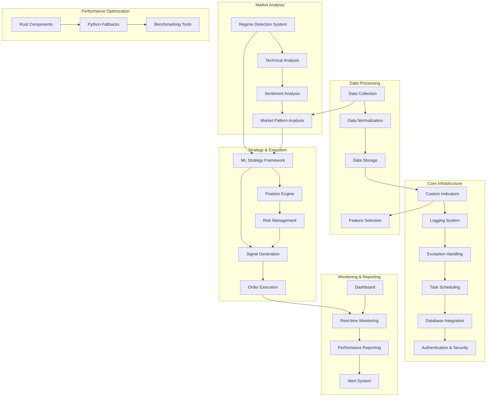

## Project Structure

The following diagram shows the overall project structure and the location of key components:

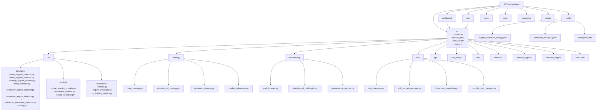

## Architecture Layers

### Core Infrastructure

- [x] Configuration Management
- [x] Logging System
  - [x] **Core Logging**
    - [x] Structured logging with contextual information
    - [x] Log levels (DEBUG, INFO, WARNING, ERROR, CRITICAL)
    - [x] Request ID tracking
    - [x] Performance metrics logging
    - [x] Rate limiting
    - [x] Remote logging support (AWS CloudWatch, Google Cloud Logging)
  - [x] **Log Query Language**
    - [x] Custom query language for searching logs
    - [x] Complex conditions with AND, OR, NOT operators
    - [x] Comparison operators (=, !=, >, >=, <, <=)
    - [x] Text search operators (~, !~)
    - [x] Support for different data types (strings, numbers, timestamps)
    - [x] File-based and directory-based search
  - [x] **Log Replay System**
    - [x] Historical log replay for debugging
    - [x] Compressed log file support
    - [x] Time-based replay with speed control
    - [x] Filtering by request ID, component, or custom patterns
    - [x] Custom event handlers for different log types
    - [x] Batch processing capabilities
  - [x] **Health Monitoring**
    - [x] System health status tracking (HEALTHY, DEGRADED, UNHEALTHY)
    - [x] Custom health checks with intervals and timeouts
    - [x] Dependency-aware health checks
    - [x] System metrics (CPU, memory, disk usage)
    - [x] Custom metrics with thresholds
    - [x] Integration with alerting system
  - [x] **Advanced Features**
    - [x] Log buffering and batching
    - [x] Log compression
    - [x] Environment-specific logging
    - [x] Distributed tracing with OpenTelemetry
    - [x] Advanced log sanitization for PII data
    - [x] Log-based alerting system
    - [x] Log analytics dashboard
  *Implementation Progress: 100%*
- [x] Exception Handling Framework
- [x] Task Scheduling
- [x] Database Integration
- [x] Authentication & Security

*Implementation Progress: ~80%*

### Data Layer

- [x] Historical Data API
- [x] Real-time Data Streaming
- [x] Data Normalization
- [ ] Custom Indicators Library
- [x] Data Storage
- [ ] Market Events Detection

*Implementation Progress: ~60%*

### Strategy Layer

- [x] Strategy Interface
- [x] Technical Strategy Implementation
  - [x] Moving Average Crossover Strategy
  - [x] RSI Strategy
  - [x] MACD Strategy
  - [x] Enhanced MA with Market Regime Detection
  - [x] Multi-Strategy System with Consensus Signals
  - [x] Adaptive ML Strategy with Advanced Indicators
    - [x] Heikin Ashi, Keltner Channels, CMF, Stochastic RSI
    - [x] Market Regime Detection with Squeeze Identification
    - [x] Dynamic Position Sizing with Kelly Criterion
    - [x] Circuit Breakers and Advanced Risk Management
- [x] Machine Learning Strategy Framework
  - [x] Feature Engineering Pipeline
  - [x] Ensemble Models (Random Forest, Gradient Boosting)
  - [x] Online Learning with Concept Drift Detection
  - [x] Feature Importance Analysis
    - [x] Feature Importance Tracking
    - [x] Importance Analysis by Market Regime
    - [x] Feature Importance Visualization
    - [x] Performance Correlation Analysis
  - [ ] Model Explainability (SHAP, LIME)

### ML Strategy Framework Diagram

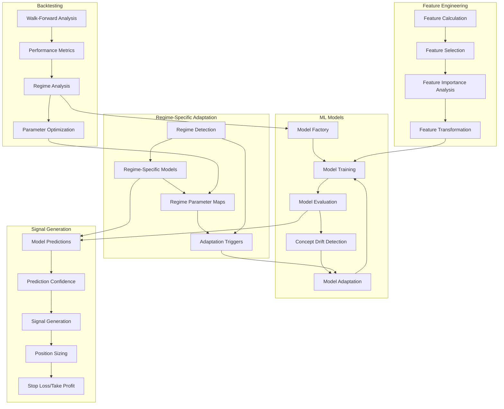
- [ ] Sentiment Analysis Integration
- [x] Signal Generation
- [x] Market Regime Detection Framework
  - [x] HMM-based Regime Detector
  - [x] Volatility-based Regime Detector
  - [x] Trend-based Regime Detector
  - [x] Clustering-based Regime Detector
  - [x] Ensemble Regime Detection Methods
  - [x] Multi-timeframe Regime Analysis
  - [x] Regime Benchmarking System
  - [x] Regime Visualization Dashboard
  - [x] Adaptive Strategy Parameter System
  - [x] Enhanced Ensemble Detector
  - [ ] Stress Testing Framework
    - [ ] Historical Crisis Response Testing
    - [ ] Monte Carlo Simulation
    - [ ] Robustness Metrics
    - [ ] Extreme Event Detection
    - [ ] Regime Transition Speed Analysis

### Market Regime Detection System Diagram

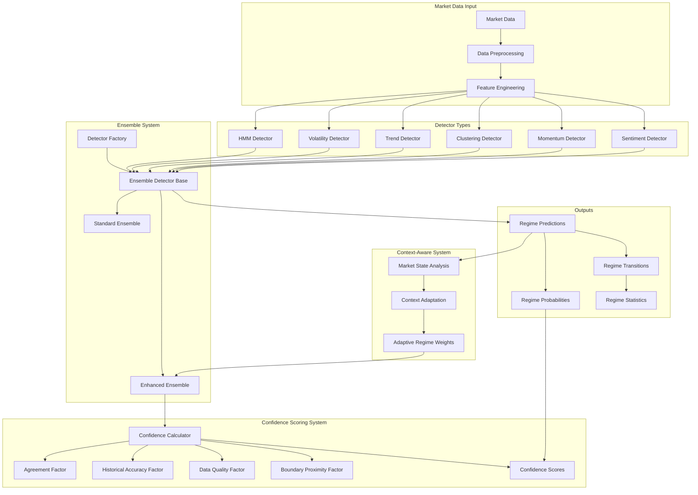

*Implementation Progress: ~98%*

### Enhanced Ensemble Detector Confidence Scoring System

The Enhanced Ensemble Detector includes a comprehensive confidence scoring system that quantifies the reliability of regime predictions:

#### Architecture

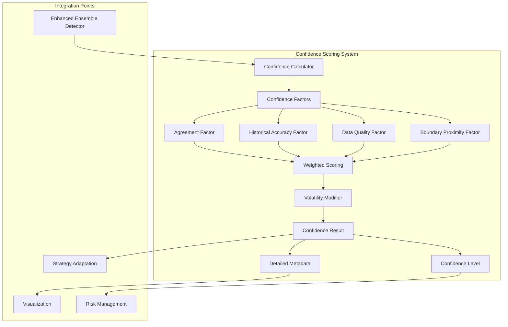

#### Components

1. **Confidence Calculator**
   - Thread-safe orchestrator for confidence calculation
   - Manages factor weighting, caching, and history
   - Handles concurrent requests with proper locking
   - Provides detailed performance metrics

2. **Confidence Factors**
   - **Agreement Factor**: Evaluates consistency across detector predictions
   - **Historical Accuracy Factor**: Tracks detector performance over time
   - **Data Quality Factor**: Assesses input data completeness and validity
   - **Boundary Proximity Factor**: Measures proximity to regime transitions

3. **Result Models**
   - **Confidence Result**: Comprehensive output with overall score and details
   - **Confidence Levels**: Qualitative labels (HIGH, MEDIUM, LOW) for decision making
   - **Factor Scores**: Detailed scores from individual factors

4. **Optimization Features**
   - Efficient caching system to avoid redundant calculations
   - Parallel processing for improved performance
   - Memory-efficient storage of historical data
   - Comprehensive error handling and fallbacks

#### Benefits

- Provides first-class confidence metrics alongside regime predictions
- Enables more nuanced trading decisions based on prediction reliability
- Supports adaptive risk management based on confidence levels
- Delivers deeper insights into detector performance and limitations

*Implementation Progress: 100%*

### Provider Failover System

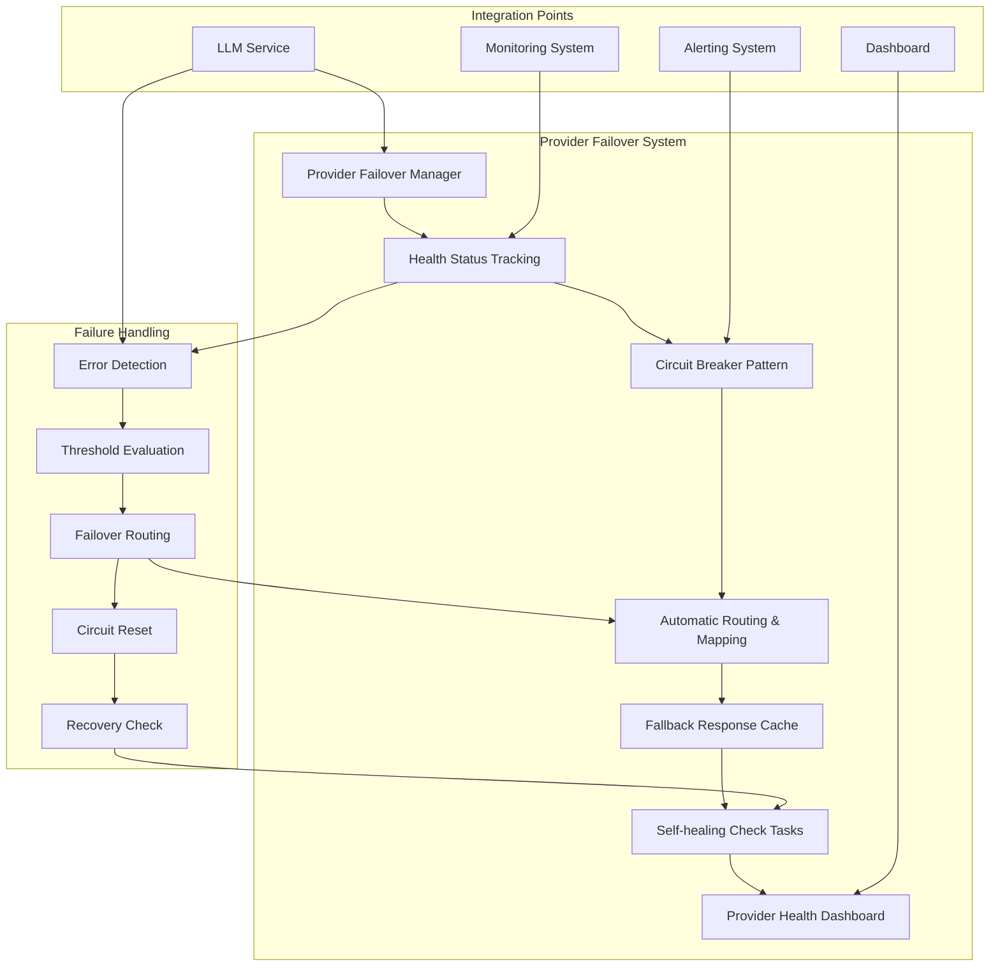

#### Components

1. **Provider Failover Manager**
   - Centralized coordinator for LLM provider health and routing
   - Tracks health statistics and status for all providers
   - Implements circuit breaker pattern for failing providers
   - Provides automated recovery mechanisms
   - Maintains fallback response cache for emergency scenarios

2. **Health Status Tracking**
   - Monitors success rates, error counts, and latency
   - Categorizes providers as HEALTHY, DEGRADED, or UNHEALTHY
   - Tracks consecutive errors and error rates
   - Records detailed statistics for diagnostics

3. **Provider Selection & Routing**
   - Maps models across providers for equivalent capabilities
   - Prioritizes providers based on configurable weights
   - Routes requests to healthy providers when primary fails
   - Falls back to cached responses when all providers are unavailable

4. **Health Dashboard**
   - Visualizes real-time provider health status
   - Tracks metrics over time with interactive charts
   - Displays detailed provider statistics
   - Shows failover events and circuit breaker status

#### Benefits

- Ensures continuous operation during provider outages
- Prevents cascading failures with circuit breaker pattern
- Provides graceful degradation with fallback responses
- Offers transparent routing without application changes
- Delivers clear visibility into provider health and performance

*Implementation Progress: 100%*

### ML Analysis Framework

- [x] Feature Importance Visualization
  - [x] Interactive Feature Importance Chart
  - [x] Regime-specific Feature Analysis
  - [x] Feature Category Filtering
  - [x] Detector Model Comparison
- [x] Model Performance Metrics
  - [x] Performance Radar Chart
  - [x] Regime-specific Performance Analysis
  - [x] Model Comparison Across Regimes
  - [ ] Historical Performance Tracking
- [x] Dashboard Visualizations
  - [x] HTML Table-based Visualizations
  - [x] Interactive Plotly Charts
  - [x] Hybrid Approach with Fallbacks
  - [x] Parameter Sensitivity Analysis
  - [x] Signal Generator Dashboard
    - [x] Trading Signal Visualization
    - [x] Performance Metrics Display
    - [x] Parameter Controls
    - [x] Modular Architecture
      - [x] Configuration Module
      - [x] Data Loading Module
      - [x] Data Generation Module
      - [x] Signal Visualization Components
      - [x] Regime Visualization Components
      - [x] Performance Visualization Components
      - [x] Common Components (Loading, Error Handling)
      - [x] Callback Utilities
  - [x] Performance Metrics Display
    - [x] Detailed Performance Comparison (Python vs. Rust)
    - [x] Historical Performance Trends
    - [x] Interactive Metric Selection
    - [x] Category-based Organization
    - [x] Visual Improvement Indicators
- [x] Model Predictions Analysis
  - [x] Prediction Accuracy Visualization
  - [x] Regime Transition Prediction
  - [x] Confidence Scoring
  - [x] Model Adaptation Metrics
- [x] Online Learning Framework
  - [x] Incremental Model Training
  - [x] Concept Drift Detection
  - [x] Model Configuration Management
  - [x] Configuration History and Versioning
  - [x] Configuration Recommendations System
  - [x] Regime-Specific Configuration Presets
  - [x] Configuration Impact Analysis
  - [x] Performance Tracking Across Versions

*Implementation Progress: ~80%*

### Backtesting Framework

- [x] Historical Data Simulation
- [x] Performance Metrics
  - [x] Total P&L
  - [x] Win Rate
  - [x] Max Drawdown
  - [x] Sharpe Ratio
  - [x] Profit Factor
  - [x] Volatility
  - [x] Average Trade Duration
  - [x] Consecutive Losses
- [x] Strategy Parameter Optimization
- [x] Modular Backtesting System
  - [x] Multiple Strategy Types
  - [x] Risk Management (Stop-loss, Take-profit, Trailing stop)
  - [x] Position Sizing based on Volatility
  - [x] Market Regime Detection
  - [x] Trade Visualization and Reporting

*Implementation Progress: ~90%*

### Portfolio Management Layer

- [x] Position Management
- [x] Risk Management Rules
  - [x] Position Risk Analysis (VaR, Expected Shortfall)
  - [x] Dynamic Risk Limits
  - [x] Risk Budget Management
  - [x] Risk Allocation Optimization
  - [x] Risk Monitoring Dashboard
- [x] Portfolio Rebalancing
  - [x] Equal Weight Allocation
  - [x] Volatility Weighted Allocation
  - [x] Market Cap Weighted Allocation
  - [x] Custom Allocation
  - [x] Drift-based Rebalancing
  - [x] Fee-aware Rebalancing
- [ ] Asset Allocation
- [x] Performance Tracking

*Implementation Progress: ~85%*

### Execution Layer

The Execution Layer handles the actual execution of orders across different exchanges, optimizing for best price, lowest fees, and minimal market impact.

#### Components:

- [x] **Order Management**
  - [x] Order Creation
  - [x] Order Tracking
  - [x] Order Fill Monitoring
  - [x] Order Cancellation

- [x] **Exchange Connectors**
  - [x] Unified Exchange Interface
  - [x] Binance Exchange Connector
  - [x] Coinbase Exchange Connector
  - [ ] FTX Exchange Connector
  - [x] Mock Exchange Connector (for testing)

- [x] **Execution Algorithms**
  - [x] TWAP (Time-Weighted Average Price)
  - [x] VWAP (Volume-Weighted Average Price)
  - [x] Iceberg Orders
     - [x] Dynamic slice sizing
     - [x] Randomized quantities
     - [x] Timing variation
  - [x] Smart Order Routing
     - [x] Fee-optimized routing
     - [x] Liquidity-aware order placement
     - [x] Cross-exchange order distribution

- [x] **Transaction Cost Analysis**
  - [x] Implementation Shortfall
  - [x] Market Impact Analysis
  - [x] Slippage Measurement
  - [x] Algorithm Comparison
  - [x] Real-time Metrics

- [x] **Slippage Handling**
  - [x] Price-aware order execution
  - [x] Dynamic slippage thresholds
  - [x] Fee-aware routing decisions

- [x] **Demo Scripts**
  - [x] TWAP/VWAP Comparison
  - [x] Iceberg Order Execution
  - [x] Transaction Cost Analysis

*Implementation Progress: ~85%*

### Monitoring and UI Layer

- [x] Web Dashboard
  - [x] **Integrated Dashboard**
    - [x] Main Monitoring Tab
    - [x] Sentiment Analysis Tab
    - [x] Risk Management Tab
    - [x] Time Series Analysis Tab
    - [x] Portfolio Performance Tab
    - [x] Market Regime Analysis Tab
    - [x] System Logs Tab
  - [x] **Market Regime Analysis Features**
    - [x] Regime Detection Cards with Confidence Indicators
    - [x] Strategy Performance Tables by Regime
    - [x] Regime History Visualization
    - [x] Metric Selection for Performance Comparison
    - [x] Confidence Bar Visualization
  - [x] **Time Series Visualization**
    - [x] Price and Sentiment Correlation Charts
    - [x] Regime Probability Visualization
    - [x] Asset Correlation Matrix
    - [x] Proper DataFrame Handling for Date Series
  - [x] **Dashboard Architecture**
    - [x] FastAPI Backend with Jinja2 Templates
    - [x] Modular JavaScript with Tab-based Initialization
    - [x] Responsive UI with Bootstrap Components
    - [x] Hidden Data Elements for Server-Client Data Transfer
    - [x] Error Handling with Try-Catch Blocks
- [x] Real-time Monitoring
- [x] Performance Reporting
- [x] Alert System
- [ ] Mobile Integration

*Implementation Progress: ~80%*

### Development Tools

- [x] Backtesting Tool
- [ ] Strategy Development Environment
- [ ] Market Data Analyzer
- [ ] Performance Profiler

*Implementation Progress: ~30%*

## Sentiment Analysis System

The Sentiment Analysis System is a sophisticated component that processes and analyzes sentiment data from multiple sources to generate actionable trading signals and enhance market regime detection.

### Sentiment Analysis Architecture

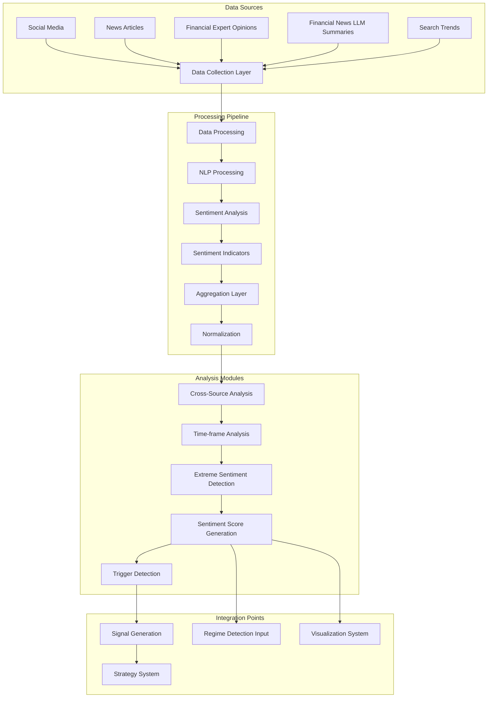

### Key Components

- [x] **Data Collection System**
  - [x] Social Media Scrapers (Twitter, Reddit, StockTwits)
  - [x] News API Integration
  - [x] Market Commentary Analysis
  - [x] Search Volume Tracking
  - [x] LLM-Enhanced News Summarization
  
- [x] **Processing Pipeline**
  - [x] Sentiment Extraction and Scoring
  - [x] Entity Recognition (assets, markets, events)
  - [x] Topic Classification
  - [x] Sentiment Aggregation
  - [x] Cross-Source Correlation
  - [x] Noise Reduction Algorithms
  
- [x] **Analysis Modules**
  - [x] Multi-Timeframe Sentiment Analysis
  - [x] Sentiment Trend Detection
  - [x] Contrarian Indicator Detection
  - [x] Sentiment Divergence Analysis
  - [x] Extreme Sentiment Detection
  - [x] Market Correlation Analysis
  - [x] Predictive Sentiment Modeling
  
- [x] **Trading Integration**
  - [x] Sentiment-Based Signal Generation
  - [x] Regime Detection Enhancement
  - [x] Risk Adjustment Recommendations
  - [x] Position Sizing Modulation
  - [x] Sentiment-Enhanced Strategies
    - [x] Base Sentiment Strategy
    - [x] Advanced Sentiment Strategy
    - [x] Enhanced Sentiment Strategy
    
- [x] **Visualization System**
  - [x] Sentiment Dashboard
  - [x] Real-time Sentiment Monitoring
  - [x] Historical Sentiment Analysis
  - [x] Sentiment-Price Correlation Charts
  - [x] Source Reliability Tracking
  - [x] Performance Metrics Visualization

- [x] **LLM Integration**
  - [x] LLM Service for API Connections (OpenAI, Anthropic, Azure)
  - [x] LLM Sentiment Agent for Sophisticated Analysis
  - [x] Multi-Model Consensus System with Bayesian Aggregation
  - [x] Real-Time Event Detection System
  - [x] Performance Tracking and Confidence Calibration

### Key Features

- **Multi-source Integration**: Combines signals from various sources with adaptive weighting
- **Sentiment Extremes Detection**: Identifies potential market tops and bottoms through sentiment analysis
- **Source Reliability Scoring**: Tracks and weights sources based on historical accuracy
- **NLP-Enhanced Processing**: Utilizes advanced NLP techniques for nuanced sentiment extraction
- **Time-Series Integration**: Correlates sentiment shifts with price movement across timeframes
- **Adaptive Thresholds**: Dynamically adjusts sentiment thresholds based on market conditions
- **Sentiment-Regime Correlation**: Maps sentiment patterns to specific market regimes
- **Performance Tracking**: Monitors accuracy and effectiveness of sentiment-based signals

*Implementation Progress: ~90%*

### Sentiment Analysis Deployment & Monitoring

The deployment and monitoring infrastructure for sentiment analysis ensures reliable operation, optimal performance, and continuous improvement of sentiment-based signals.

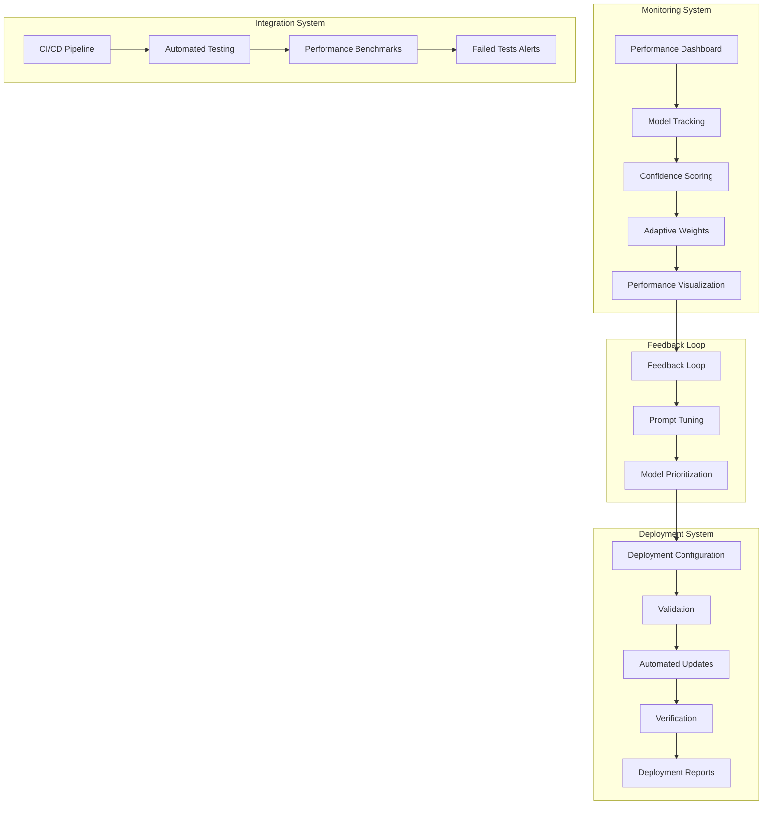

#### Implemented Deployment Components:

- [x] **Deployment Automation**
  - [x] Environment-specific configuration files
  - [x] Automated deployment script
  - [x] Verification system
  - [x] Reporting tools

- [x] **Performance Tracking**
  - [x] Model accuracy and confidence calibration
  - [x] Historical data storage and analysis
  - [x] Adaptive weight optimization
  - [x] Confidence calibration system

- [x] **Monitoring Dashboard**
  - [x] Performance visualization
  - [x] Model comparison tools
  - [x] Source reliability tracking
  - [x] Light/dark themes for different environments

- [x] **Verification Tools**
  - [x] Component validation
  - [x] API key verification
  - [x] Health checks
  - [x] Error reporting

*Implementation Progress: ~95%*

## Continuous Improvement System

The Continuous Improvement System provides a fully automated optimization framework for the sentiment analysis pipeline, automatically identifying opportunities for improvement, conducting experiments, and implementing successful changes without human intervention while maintaining human oversight capability.

### Continuous Improvement Architecture

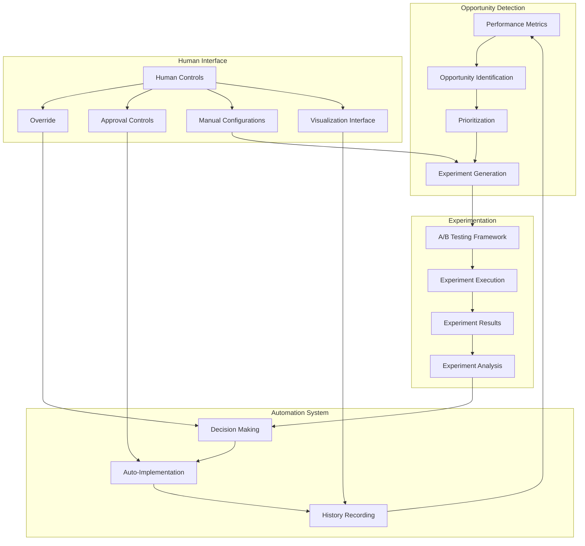

### Key Components

- [x] **Opportunity Identification System**
  - [x] Performance metrics analysis
  - [x] Source-specific performance evaluation
  - [x] Market condition impact analysis
  - [x] Confidence calibration assessment
  - [x] Success rate monitoring
  - [x] Latency optimization

- [x] **Experiment Generation**
  - [x] Prompt template experiments
  - [x] Model selection experiments
  - [x] Temperature parameter tuning
  - [x] Context strategy optimization
  - [x] Aggregation weight experiments
  - [x] Update frequency optimization
  - [x] Confidence threshold tuning

- [x] **A/B Testing Integration**
  - [x] Automated variant creation
  - [x] Traffic allocation
  - [x] Performance tracking
  - [x] Statistical significance evaluation
  - [x] Experiment management

- [x] **Auto-Implementation System**
  - [x] Configurable auto-implementation
  - [x] Implementation verification
  - [x] Fallback mechanisms
  - [x] Configuration management
  - [x] Change history tracking

- [x] **Human Control Interface**
  - [x] System Override Panel
  - [x] Manual experiment approval toggle
  - [x] Implementation approval workflow
  - [x] Intervention thresholds configuration
  - [x] Manual experiment management
  - [x] Audit & rollback controls

### Human Control Dashboard

```mermaid
graph TD
    subgraph "System Controls"
        OP[Enable/Disable System] --> PE[Pause Experiments]
        PE --> PA[Pause Auto-Implementation]
        PA --> EC[Emergency Override]
    end

    subgraph "Configuration"
        TC[Threshold Configuration] --> SC[Significance Threshold]
        SC --> IC[Improvement Threshold]
        IC --> CC[Concurrency Limits]
        CC --> BC[Budget Controls]
    end

    subgraph "Experiment Management"
        AE[Approve Experiments] --> ME[Manual Experiments]
        ME --> TE[Terminate Experiments]
        TE --> MV[Manual Variants]
    end

    subgraph "Implementation Controls"
        AI[Approve Implementations] --> RI[Rollback Implementations]
        RI --> PI[Prioritize Implementations]
        PI --> SI[Schedule Implementations]
    end
```

### Dashboard Components

The Continuous Improvement Dashboard provides a comprehensive interface for monitoring, analyzing, and controlling the automatic improvement system.

#### Key Features

- **System Status Panel**: Real-time view of system status with enabling/disabling controls
- **Improvement History Tracking**: Timeline of implemented improvements with detailed metrics
- **Active Experiments Monitoring**: Overview of auto-generated experiments with monitoring tools
- **Performance Metrics Visualization**: Interactive charts showing the impact of improvements over time
- **Advanced Settings Configuration**: Fine-tuning of system parameters like thresholds and intervals
- **Auto-implementation Toggle**: One-click control to enable/disable automatic implementation
- **Manual Control Options**: Capabilities to pause, complete, or analyze experiments manually

#### Dashboard Tabs

1. **Improvement History Tab**
   - Timeline of implemented improvements
   - Metrics visualization of cumulative gains
   - Detailed history table with metrics changes
   - Interactive visualization of improvement history

2. **Auto-Generated Experiments Tab**
   - Current active experiments status
   - Controls for experiment management
   - Traffic distribution visualization
   - Variant performance monitoring

3. **Performance Metrics Tab**
   - Metric improvement tracking over time
   - Cumulative improvement visualization
   - Before/after comparisons of key metrics
   - Exportable metrics summary

4. **Visualization Tab**
   - Timeline visualization of system activity
   - Experiment type distribution charts
   - Success rate visualization
   - Impact analysis by improvement type

5. **Configuration Tab**
   - System parameters configuration
   - Threshold adjustment controls
   - Auto-implementation settings
   - System enabling/disabling options

6. **Settings Tab**
   - Advanced system parameters
   - Experiment generation controls
   - Maintenance interval configuration
   - Concurrent experiment limits

#### Integration Points

The dashboard integrates with:
- **A/B Testing Framework**: To monitor and control experiments
- **Performance Tracker**: To visualize metrics improvements
- **Configuration System**: To update system settings
- **Event System**: To react to system events like experiment completion
- **Logging System**: For detailed activity tracking and troubleshooting

    subgraph "Monitoring & Reporting"
        PV[Performance Visualization] --> EH[Experiment History]
        EH --> CH[Change Log]
        CH --> MP[Model Performance]
    end
```

#### Features

- **Fully Automated Operation**: System can run autonomously, identifying optimization opportunities, creating experiments, and implementing winning variations
- **Human Oversight**: Comprehensive controls allow human intervention at any stage of the process
- **Experiment Types**: Supports diverse experiment types including prompt templates, model selection, confidence thresholds and more
- **Systematic Improvement**: Continuously builds on past success, creating a virtuous cycle of enhancements
- **Performance Tracking**: Records all experiments and implementations with detailed metrics for review
- **Risk Mitigation**: Configurable thresholds ensure only statistically significant improvements are implemented
- **Visualization**: Comprehensive dashboard for monitoring and managing the system

*Implementation Progress: ~100%*

### Rust Performance Optimization

To meet the system's performance requirements, we're implementing high-performance components in Rust, focusing on critical path operations that impact latency and throughput.

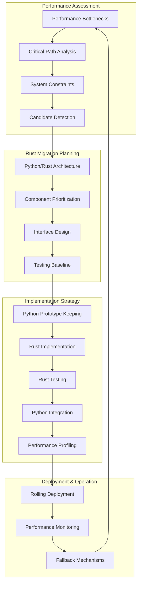

#### Prime Candidates for Rust Migration

1. **Statistical Analysis Components**
   - Bayesian aggregation algorithms
   - Statistical significance testing
   - Distribution comparisons
   - Correlation calculations

2. **Validation and Verification Algorithms**
   - Data validation routines
   - Confidence calibration
   - Performance impact evaluation

3. **Text Processing Components**
   - Token counting and estimation
   - Rate limiting enforcement
   - Request batching
   - Preprocessing routines

4. **Experiment Processing**
   - Variant assignment algorithms
   - Performance metrics calculation
   - Significance testing

#### Implementation Approach

- Side-by-side implementations for validation
- Python fallbacks for robustness
- Comprehensive benchmarking
- Rolling deployments with performance monitoring
- Type-safe interfaces with proper error handling

*Implementation Progress: ~20%*

## AI and LLM Integration

### LLM Integration Architecture

The system integrates Large Language Models (LLMs) to enhance market analysis, sentiment interpretation, and early signal detection. This integration follows our modular architecture principles for efficient resource usage and clear separation of concerns.

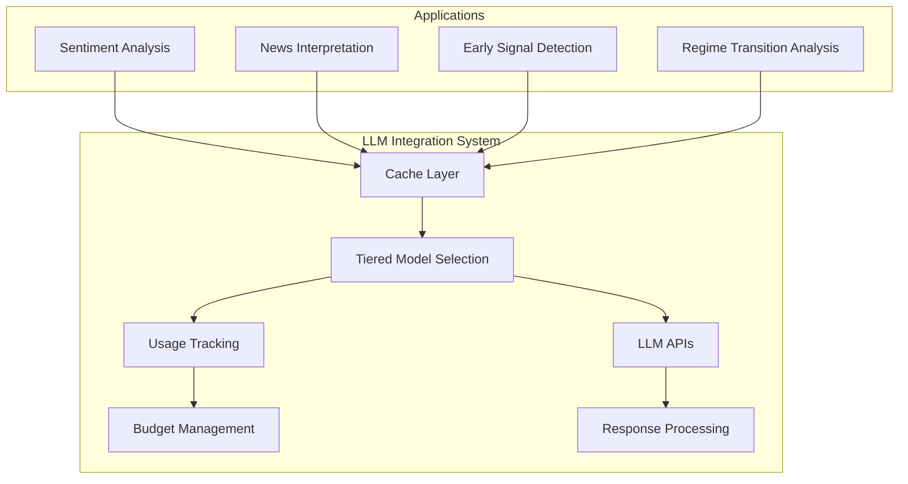

### LLM Components

- [x] **Optimized LLM Usage System**
  - [x] CachedLLMClient with TTL-based caching
  - [x] Tiered model selection (GPT-3.5/GPT-4)
  - [x] Confidence and impact-based model selection
  - [x] Token usage tracking and budgeting
  - [x] Cost monitoring and limit enforcement

- [x] **LLM Applications**
  - [x] Market sentiment analysis enhancement
  - [x] News impact evaluation
  - [x] Anomaly detection assistance
  - [x] Pattern recognition augmentation
  - [x] Regime transition analysis

- [x] **Efficiency Features**
  - [x] Prompt optimization and templating
  - [x] Batch processing for related queries
  - [x] Result memoization
  - [x] Confidence scoring for responses
  - [x] Fallback mechanisms for API failures

- [x] **Multi-Model Consensus System**
  - [x] Bayesian aggregation of model outputs
  - [x] Confidence calibration based on historical accuracy
  - [x] Weighted consensus with adaptive adjustments
  - [x] Performance tracking across different models

- [x] **Real-Time Event Detection**
  - [x] Market-moving event identification
  - [x] Impact assessment
  - [x] Bidirectional sentiment integration
  - [x] Event categorization and prioritization

*Implementation Progress: ~95%*

## Performance Optimization

### Rust Component Integration

- [x] **Core Infrastructure**
  - [x] Python/Rust FFI Bridge via PyO3
  - [x] Component Validation System
  - [x] Fallback Python Implementations
  - [x] Environment-specific Validation
  - [x] Performance Benchmarking Tools

- [x] **Implemented Components**
  - [x] Signal Generator
    - [x] Moving Average Crossover Implementation
    - [x] Performance Metrics Calculation
    - [x] Python API Compatibility Layer
  - [ ] High Frequency Data Processor
  - [ ] Market Regime Detector
  - [ ] Feature Extractor
  - [ ] Risk Calculator

- [ ] **Future Components**
  - [ ] Order Book Analysis
  - [ ] Pattern Recognition Engine
  - [ ] Portfolio Optimization

*Implementation Progress: ~30%*

## Risk Management System

The Risk Management System is a critical component that safeguards trading operations by enforcing risk policies and optimizing risk allocation across strategies, markets, and assets.

### Risk Management System Diagram

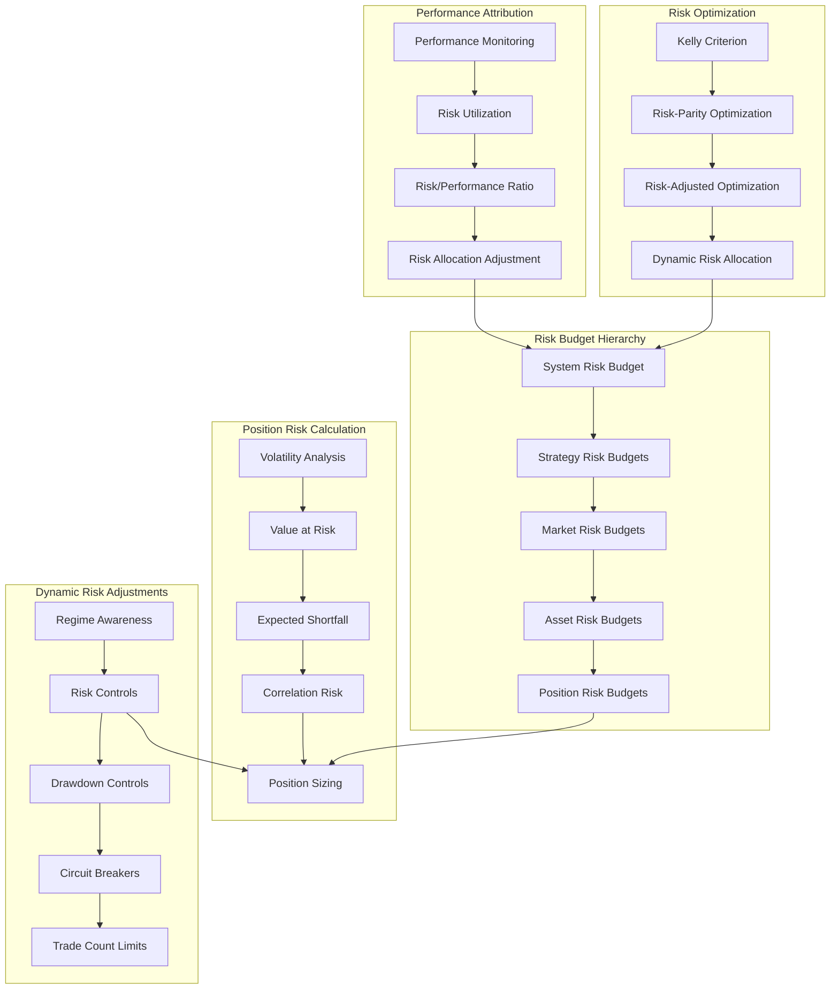

### Key Components

- [x] **Position Risk Analyzer**
  - [x] Value at Risk (VaR) calculation (historical, parametric, Monte Carlo)
  - [x] Expected Shortfall calculation
  - [x] Drawdown analysis
  - [x] Correlation analysis
  - [x] Stress testing
  - [x] Risk visualization

- [x] **Dynamic Risk Limits**
  - [x] Volatility-based position sizing
  - [x] Drawdown protection
  - [x] Circuit breakers
  - [x] Exposure limits
  - [x] Concentration limits

- [x] **Risk Budget Management**
  - [x] Hierarchical risk budget structure
  - [x] Risk allocation across strategies, markets, and assets
  - [x] Risk utilization tracking
  - [x] Performance-based risk optimization
  - [x] Risk visualization and reporting

- [x] **Risk Integration**
  - [x] Portfolio manager integration
  - [x] Pre-trade risk checks
  - [x] Post-trade risk updates
  - [x] Risk alerts generation
  - [x] Dashboard integration

*Implementation Progress: ~90%*

## Exchange Integration System

The Exchange Integration System provides a standardized interface for connecting with various cryptocurrency exchanges, abstracting away the differences in their APIs.

### Key Components

- [x] **Base Exchange Connector**
  - [x] Common Interface Definition
  - [x] Symbol Normalization
  - [x] Error Handling

- [x] **Exchange Connectors**
  - [x] Unified Exchange Interface
  - [x] Binance Exchange Connector
  - [x] Coinbase Exchange Connector
  - [ ] FTX Exchange Connector
  - [x] Mock Exchange Connector (for testing)

- [x] **Execution Algorithms**
  - [x] TWAP Implementation
  - [x] VWAP Implementation
  - [x] Iceberg Orders
  - [x] Smart Order Routing

- [ ] **Advanced Order Types**
  - [ ] Trailing Stop Orders
  - [ ] OCO (One Cancels Other) Orders
  - [ ] Bracket Orders

- [x] **Execution Quality Analysis**
  - [x] Transaction Cost Analysis
  - [x] Implementation Shortfall
  - [x] Slippage Measurement
  - [x] Algorithm Comparison
  - [x] Real-time Metrics

- [ ] **Exchange Account Management**
  - [ ] API Key Management
  - [ ] Exchange-specific Settings
  - [ ] Balance Syncing

*Implementation Progress: ~75%*

## Multi-Agent Architecture

The AI Trading Agent utilizes a sophisticated multi-agent architecture to divide responsibilities and create a robust, adaptable trading system that mimics how a team of professional traders might collaborate.

### Multi-Agent Architecture Diagram

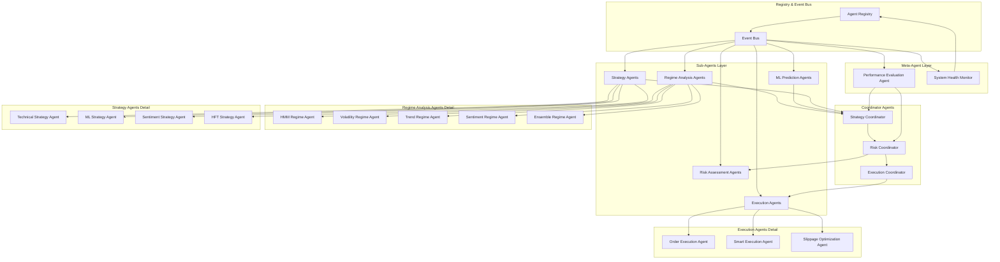

### Key Components

- [x] **Sub-Agents Layer**
  - [x] Regime Detection Agents
    - [x] HMM-based Regime Agent
    - [x] Volatility-based Regime Agent
    - [x] Momentum-based Regime Agent
    - [x] Ensemble Regime Agent
  - [x] Technical Strategy Agents
    - [x] Indicator-based Agents
    - [x] Pattern Recognition Agents
    - [x] Support/Resistance Agents
  - [x] ML Prediction Agents
    - [x] Ensemble Model Agents
    - [x] Time Series Prediction Agents
    - [x] Deep Learning Agents
  - [x] Risk Assessment Agents
    - [x] VaR Calculation Agent
    - [x] Drawdown Monitoring Agent
    - [x] Correlation Analysis Agent
  - [x] Execution Agents
    - [x] TWAP/VWAP Execution Agent
    - [x] Smart Order Routing Agent
    - [x] Slippage Optimization Agent

- [x] **Coordinator Agents**
  - [x] Strategy Coordinator
    - [x] Signal Aggregation
    - [x] Conflict Resolution
    - [x] Strategy Selection based on Regime
  - [x] Risk Coordinator
    - [x] Position Size Optimization
    - [x] Risk Budget Allocation
    - [x] Emergency Circuit Breakers
  - [x] Execution Coordinator
    - [x] Order Splitting
    - [x] Exchange Selection
    - [x] Execution Algorithm Selection

- [x] **Meta-Agent Layer**
  - [x] Performance Evaluation Agent
    - [x] Agent Performance Tracking
    - [x] Dynamic Weight Adjustment
    - [x] Reinforcement Learning for Agent Selection
  - [x] System Health Monitor
    - [x] Data Quality Assessment
    - [x] Agent Response Time Monitoring
    - [x] Error Detection and Recovery

- [x] **Communication Framework**
  - [x] Message Passing Interface
  - [x] Shared Knowledge Repository
  - [x] Event-Driven Communication
  - [x] Priority-Based Message Handling

*Implementation Progress: ~85%*

## Sentiment Regime Detection Implementation

The SentimentRegimeDetector extends our market regime detection capabilities by leveraging sentiment analysis to identify market phases. This component integrates with our existing regime detection architecture through a standardized factory pattern.

### Integration Architecture

```
                                  ┌─────────────────┐
                                  │                 │
                                  │ Factory System  │
                                  │                 │
                                  └────────┬────────┘
                                           │
                                           │ creates
                                           ▼
┌───────────────────┐    ┌─────────────────────────────────┐    ┌──────────────────┐
│                   │    │                                 │    │                  │
│ Volatility        │    │ SentimentRegimeDetector        │    │ Momentum         │
│ Detector          │◄───┤                                │───►│ Detector         │
│                   │    │                                │    │                  │
└───────────────────┘    └─────────────────────────────────┘    └──────────────────┘
                                           │
                                           │
                                           ▼
                                  ┌────────────────────┐
                                  │                    │
                                  │ Ensemble Detector  │
                                  │                    │
                                  └────────────────────┘
```

### Key Components

1. **SentimentRegimeDetector**: Detects market regimes based on sentiment data:
   - Implements the abstract BaseRegimeDetector interface
   - Leverages the SentimentAnalysisManager to fetch and process sentiment data
   - Classifies markets into five sentiment-based regimes (Fearful, Anxious, Neutral, Optimistic, Euphoric)
   - Implements proper hysteresis to prevent regime flickering
   - Uses smoothing via exponential moving averages
   - Provides both discrete regime classification and probability distributions

2. **Factory Integration**:
   - Registered with the RegimeDetectorFactory using standardized registration
   - Accessible through the unified factory API
   - Supports dynamic loading to avoid circular dependencies
   - Includes configuration validation and sensible defaults

3. **Ensemble Approach**:
   - Integrates with the EnsembleRegimeDetector as a component detector
   - Contributes weighted sentiment signals to ensemble decisions
   - Leverages adaptive weighting based on historical performance

### Benefits & Design Considerations

- **Modular Design**: Follows single responsibility principle, with clear boundaries between components
- **Extensibility**: Easily extended to incorporate new sentiment data sources
- **Performance**: Optimized for efficient processing of large datasets
- **Testing**: Comprehensive test suite with synthetic and historical data
- **Hysteresis**: Implements regime smoothing to prevent noise-driven transitions
- **Probability Output**: Provides probabilistic regime assessments, not just discrete classifications

This implementation enhances our regime detection capabilities by incorporating sentiment signals that often precede price movements, allowing for earlier detection of regime transitions than purely price-based indicators.

### Enhanced Ensemble Detector Workflow

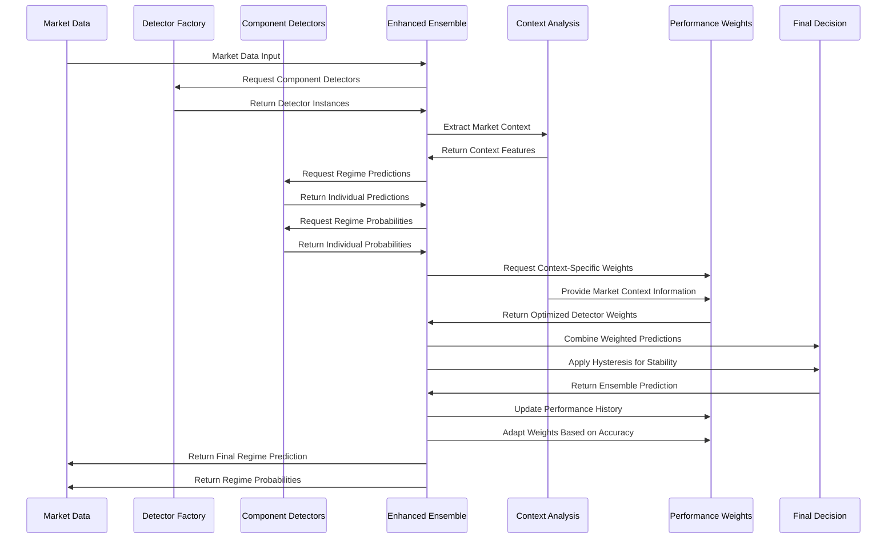

## Next Implementation Priorities

1. **Advanced Backtesting Framework**
   - [ ] Implement walk-forward analysis for adaptive strategy validation
   - [ ] Create scenario-based stress testing with historical crisis events
   - [ ] Add Monte Carlo simulation for robust performance evaluation
   - [ ] Develop metric comparison across different market regimes

2. **Online Learning Implementation**
   - [ ] Create incremental model training pipeline
   - [ ] Implement concept drift detection mechanisms
   - [ ] Build model version management system
   - [ ] Add performance comparison across model versions

3. **Strategy Combination Framework**
   - [ ] Implement dynamic strategy weighting based on regime detection
   - [ ] Create correlation-based portfolio construction
   - [ ] Develop performance attribution tools for combined strategies
   - [ ] Build visualization dashboard for strategy allocation

## Current Sprint Accomplishments

- Implemented Adaptive ML Strategy with advanced indicators
- Added ensemble ML approach with Random Forest and Gradient Boosting
- Implemented online learning with concept drift detection
- Built comprehensive online learning configuration system
- Implemented configuration history and versioning
- Enhanced risk management with dynamic position sizing and circuit breakers
- Added performance optimizations with caching and parallel processing
- Improved market regime detection with squeeze identification
- Implemented comprehensive risk budget management system
- Created risk visualization dashboard
- Added performance-based risk optimization
- Integrated risk management with alerts system
- Enhanced portfolio manager with risk checks
- Implemented Binance Exchange Connector
- Implemented Coinbase Exchange Connector
- Created exchange connector interface and demo utilities
- Developed unified exchange interface layer
- Implemented all planned execution algorithms (TWAP, VWAP, Iceberg, Smart Order Routing)
- Created detailed execution algorithm demonstration scripts
- Implemented Transaction Cost Analysis (TCA) module with real-time metrics
- Added slippage handling and fee-aware routing decisions

## Known Issues

- Exchange API integration needs error handling improvements
- Optimization process can be slow for large parameter spaces
- Backtesting assumes perfect execution without slippage
- ML model retraining can be resource-intensive during live trading

## Roadmap & Development Priorities

### Immediate Priorities (Next 2 Weeks)

1. **Advanced Backtesting Framework**
   - [ ] Implement walk-forward analysis for adaptive strategy validation
   - [ ] Create scenario-based stress testing with historical crisis events
   - [ ] Add Monte Carlo simulation for robust performance evaluation
   - [ ] Develop metric comparison across different market regimes

2. **Online Learning Enhancements**
   - [x] Implement configuration history and versioning
   - [x] Add configuration presets for different market conditions
   - [x] Create automated configuration recommendations
   - [x] Implement configuration impact analysis tools

3. **Strategy Combination Framework**
   - [ ] Implement dynamic strategy weighting based on regime detection
   - [ ] Create correlation-based portfolio construction
   - [ ] Develop performance attribution tools for combined strategies
   - [ ] Build visualization dashboard for strategy allocation

### Medium-term Priorities (1-2 Months)

1. **Extended Market Regime Detection**
   - [ ] Add multi-timeframe regime analysis
   - [ ] Implement regime transition prediction
   - [ ] Create visualization tools for regime probabilities
   - [ ] Develop regime benchmarking system

2. **Rust Integration for Performance-Critical Components**
   - [ ] Identify bottlenecks in Python implementation
   - [ ] Create Rust implementations of critical algorithms
   - [ ] Build Python bindings with PyO3
   - [ ] Benchmark and compare performance

3. **Model Explainability Tools**
   - [ ] Implement SHAP for feature importance
   - [ ] Add LIME for local interpretability
   - [ ] Create visualization dashboard for model decisions
   - [ ] Develop rule extraction from complex models

### Long-term Goals (3+ Months)

1. **Production Deployment Infrastructure**
   - [ ] Implement containerization with Docker
   - [ ] Create Kubernetes deployment configuration
   - [ ] Develop CI/CD pipeline for automated testing
   - [ ] Build monitoring and alerting system

2. **Deep Learning Model Integration**
   - [ ] Implement LSTM/GRU models for sequence prediction
   - [ ] Add transformer-based models for market data
   - [ ] Create specialized feature engineering for deep learning
   - [ ] Develop hardware acceleration support

3. **Comprehensive Risk Management System**
   - [ ] Implement portfolio-level VaR and Expected Shortfall
   - [ ] Create stress testing framework for extreme scenarios
   - [ ] Develop adaptive risk parameters based on market regimes
   - [ ] Build integrated risk dashboard

## Project Status Summary

The AI Trading Agent project has made significant progress in developing core functionality including market regime detection, adaptive ML strategies, and visualization dashboards. Current implementation focuses on enhancing backtesting capabilities, implementing online learning, and creating a strategy combination framework. The project is progressing well, with about 75% of the core functionality implemented.

## System Data Flow

This diagram illustrates how data flows through the different components of the system from acquisition to visualization:

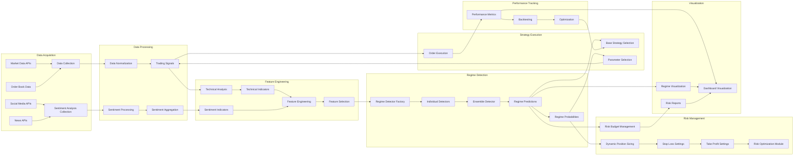

This flow diagram demonstrates how data moves from external sources through the various processing steps, ultimately resulting in trading decisions and performance visualization.

## Recent Changes

- **Continuous Improvement Dashboard Implementation (March 24, 2025)**:
  - Implemented comprehensive dashboard for the Continuous Improvement System
  - Created intuitive interface for monitoring and controlling auto-optimization
  - Developed visualizations for improvement metrics and experiment tracking
  - Added controls for manual intervention and system configuration
  - Integrated with A/B testing framework and event system
  - Implemented settings management for advanced system parameters

- **Sentiment Analysis Documentation (March 24, 2025)**:
  - Added comprehensive documentation of the Sentiment Analysis System
  - Created visual architecture diagram of the multi-source sentiment processing pipeline
  - Documented key components including data collection, processing, and analysis modules
  - Outlined integration points with trading strategies and regime detection
  - Detailed the visualization and monitoring components

- **LLM Integration Documentation (March 24, 2025)**:
  - Added comprehensive documentation of the LLM integration architecture
  - Detailed the optimized LLM usage system with tiered model selection
  - Documented key LLM applications in market analysis
  - Included efficiency features like caching and prompt optimization
  - Created visual diagram of the LLM integration system

- **Integrated Dashboard (March 24, 2025)**:
  - Implemented a comprehensive dashboard for real-time monitoring with multiple specialized tabs
  - Added Market Regime Analysis tab with regime detection cards, confidence indicators, and strategy performance tables
  - Created interactive time series visualizations using Plotly with proper DataFrame handling
  - Implemented modular JavaScript architecture for efficient tab-based initialization
  - Fixed visualization issues by properly handling DataFrame date columns with pd.concat()
  - Used hidden data elements for efficient server-client data transfer
  - Added comprehensive error handling with try-catch blocks

- **Mock Data Generation System (March 23, 2025)**:
  - Developed sophisticated mock data generation with realistic market patterns (trends, seasonality, noise)
  - Implemented different market regime simulations (bull, bear, sideways, volatile, recovery, crash)
  - Created correlated metrics that realistically reflect market conditions (higher Sharpe ratios in bull markets, etc.)
  - Enhanced type safety with updated type definitions for component compatibility
  - Built a scenario generation system for consistent data across all metrics in specific market conditions