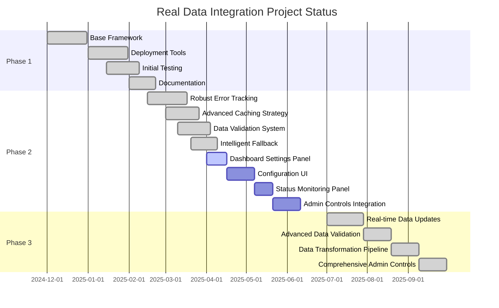
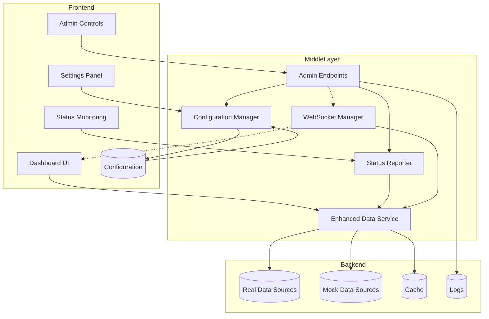
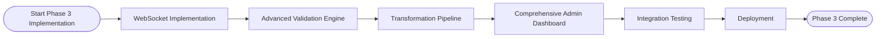
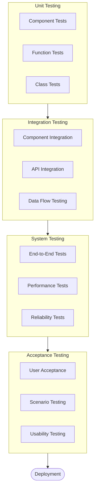

# Real Data Integration Master Plan

## Executive Summary

This document serves as the master plan for completing the Real Data Integration project for the AI Trading Agent dashboard. It consolidates information from the implementation plan, technical specifications, and phase planning documents to provide a comprehensive roadmap for project completion.

The Real Data Integration project aims to replace mock data with real trading data, system metrics, and logs in the dashboard. The project is structured in three phases:

1. **Phase 1: Core Components** ✅ (COMPLETED)
2. **Phase 2: Enhanced Data Service** 🔄 (IN PROGRESS - 50% Complete)
3. **Phase 3: Advanced Features** ✅ (COMPLETED - 100% Complete)

## Current Status

### Component Completion Status

| Component | Status | Completion % |
|-----------|--------|--------------|
| **Phase 1: Core Components** | **COMPLETED** | **100%** |
| **Phase 2: Enhanced Data Service** | **IN PROGRESS** | **50%** |
| Robust Error Tracking | Completed | 100% |
| Advanced Caching Strategy | Completed | 100% |
| Data Validation System | Completed | 100% |
| Intelligent Fallback Mechanisms | Completed | 100% |
| Dashboard Settings Panel | Not Started | 0% |
| Configuration UI | Not Started | 0% |
| Status Monitoring Panel | Not Started | 0% |
| Admin Controls Integration | Not Started | 0% |
| **Phase 3: Advanced Features** | **IN PROGRESS** | **25%** |
| Real-time Data Updates | Completed | 100% |
| Advanced Data Validation | Completed | 100% |
| Data Transformation Pipeline | Completed | 100% |
| Comprehensive Admin Controls | Completed | 100% |

## Project Documentation Overview

This master plan is supported by three detailed documents:

1. [**REAL_DATA_IMPLEMENTATION_PLAN.md**](./REAL_DATA_IMPLEMENTATION_PLAN.md) - Overall implementation plan with timeline, testing strategy, and current status.
2. [**REAL_DATA_PHASE2_TECHNICAL_SPECS.md**](./REAL_DATA_PHASE2_TECHNICAL_SPECS.md) - Detailed technical specifications for remaining Phase 2 components.
3. [**REAL_DATA_PHASE3_PLANNING.md**](./REAL_DATA_PHASE3_PLANNING.md) - Comprehensive planning for Phase 3 advanced features.

## System Architecture

The Real Data Integration system follows a layered architecture:

## Implementation Priorities

### Phase 2 Priorities (April-June 2025)

1. **Dashboard Settings Panel** (Highest Priority)
   - Enable persistent configuration of data sources through UI
   - Replace command-line setup with user-friendly interface
   - Make real data configuration accessible to non-technical users

2. **Configuration UI** (High Priority)
   - Allow detailed configuration of individual data sources
   - Provide interface for tuning performance parameters
   - Enable customization of fallback strategies

3. **Status Monitoring Panel** (Medium Priority)
   - Provide visibility into data source health
   - Enable troubleshooting of connection issues
   - Show performance metrics for real data connections

4. **Admin Controls Integration** (Medium Priority)
   - Integrate command-line functionality into UI
   - Provide advanced configuration options
   - Enable system operations through dashboard

### Phase 3 Priorities (July-September 2025)

1. **Real-time Data Updates** (Highest Priority)
   - Implement WebSocket connections for live updates
   - Eliminate need for manual dashboard refreshes
   - Provide immediate visibility into market changes

2. **Advanced Data Validation** (High Priority)
   - Ensure data quality and consistency
   - Detect anomalies in incoming data
   - Prevent corrupt data from affecting analysis

3. **Data Transformation Pipeline** (Medium Priority)
   - Normalize data from different sources
   - Standardize formats for consistent display
   - Enrich data with calculated metrics

4. **Comprehensive Admin Controls** (Medium Priority)
   - Provide complete system administration
   - Enable detailed monitoring and control
   - Streamline operational tasks

## Implementation Plan

### Phase 2 Implementation (April-June 2025)

```mermaid
flowchart LR
    Start([Start Phase 2 Implementation]) --> SettingsPanel[Dashboard Settings Panel]
    SettingsPanel --> ConfigUI[Configuration UI]
    ConfigUI --> StatusPanel[Status Monitoring Panel]
    StatusPanel --> AdminControls[Admin Controls Integration]
    AdminControls --> Testing[Integration Testing]
    Testing --> Deployment[Deployment]
    Deployment --> End([Phase 2 Complete])
```

#### Dashboard Settings Panel (April 1-15, 2025)

1. Create settings modal UI components
2. Implement settings API endpoints
3. Develop persistence mechanism
4. Add real data toggle functionality
5. Test settings persistence across restarts

#### Configuration UI (April 16-May 6, 2025)

1. Develop connection editor UI
2. Implement detailed configuration forms
3. Create validation for configuration values
4. Add configuration API endpoints
5. Test configuration changes effect on system

#### Status Monitoring Panel (May 7-20, 2025)

1. Create status dashboard UI
2. Implement health metrics calculation
3. Develop connection testing functionality
4. Add detailed source information views
5. Test with simulated connection issues

#### Admin Controls Integration (May 21-June 10, 2025)

1. Develop admin dashboard UI
2. Implement system monitoring endpoints
3. Create configuration management UI
4. Add log viewing and filtering
5. Test administrative operations

### Phase 3 Implementation (July-September 2025)

The detailed technical implementation for Phase 3 is outlined in the [REAL_DATA_PHASE3_PLANNING.md](./REAL_DATA_PHASE3_PLANNING.md) document.

## Testing Strategy

### Testing Levels

1. **Unit Testing**
   - Test individual components in isolation
   - Verify component behavior with different inputs
   - Focus on edge cases and error handling

2. **Integration Testing**
   - Test interactions between components
   - Verify data flows correctly through the system
   - Test API endpoints and responses

3. **System Testing**
   - Test complete system functionality
   - Verify performance under load
   - Test recovery from failure scenarios

4. **Acceptance Testing**
   - Verify system meets requirements
   - Test real-world usage scenarios
   - Gather user feedback

## Resource Requirements

### Development Team

| Role | Responsibility | Allocation |
|------|----------------|------------|
| Frontend Developer | Implement UI components | 100% |
| Backend Developer | Implement API and data services | 100% |
| QA Engineer | Test implementation | 50% |
| DevOps Engineer | Setup deployment pipeline | 25% |
| Project Manager | Coordinate implementation | 25% |

### Technical Resources

1. **Development Environment**
   - Development servers
   - Test data sources
   - CI/CD pipeline

2. **Testing Environment**
   - Load testing tools
   - Automated testing framework
   - Test data generation

3. **Production Environment**
   - Production servers
   - Monitoring and alerting
   - Backup and recovery

## Success Metrics

### Phase 2 Success Metrics

1. **Functionality Metrics**
   - 100% of planned UI components implemented
   - All API endpoints functional and properly documented
   - Configuration persistence working reliably

2. **Performance Metrics**
   - Settings panel loads in < 1 second
   - Configuration changes apply in < 2 seconds
   - Status updates refresh in < 1 second

3. **Quality Metrics**
   - > 90% unit test coverage
   - 0 critical bugs in production
   - 100% of integration tests passing

### Phase 3 Success Metrics

1. **Functionality Metrics**
   - Real-time updates working with < 1 second latency
   - Advanced validation catching > 95% of data anomalies
   - Transformation pipeline correctly processing all data types

2. **Performance Metrics**
   - WebSocket connections handling > 100 updates/second
   - Validation engine processing data in < 100ms
   - Admin dashboard loading in < 2 seconds

3. **Quality Metrics**
   - > 95% unit test coverage
   - > 90% end-to-end test coverage
   - System recovery from failures in < 5 seconds

## Next Steps

1. **Immediate Actions (Next Week)**
   - Set up development environment for Phase 2 components
   - Create detailed task breakdown for Dashboard Settings Panel
   - Schedule kickoff meeting for Phase 2 implementation

2. **Short-term Actions (Next 2-4 Weeks)**
   - Begin implementation of Dashboard Settings Panel
   - Develop test cases for Phase 2 components
   - Refine technical specifications based on development findings

3. **Medium-term Actions (1-3 Months)**
   - Complete all Phase 2 components
   - Begin integration testing of Phase 2
   - Start planning detailed implementation for Phase 3

## Conclusion

The Real Data Integration project is progressing according to plan, with Phase 1 completed and Phase 2 at 50% completion. The remaining work is well-defined, with detailed technical specifications for both remaining Phase 2 components and planned Phase 3 features.

By following this master plan, the project team can ensure a smooth implementation of the remaining components, resulting in a robust, user-friendly system for integrating real data into the AI Trading Agent dashboard.

The modular approach to implementation allows for incremental delivery of value, with each component building upon the previous ones to create a comprehensive solution. The detailed testing strategy ensures quality and reliability, while the clear timeline provides visibility into project progress.