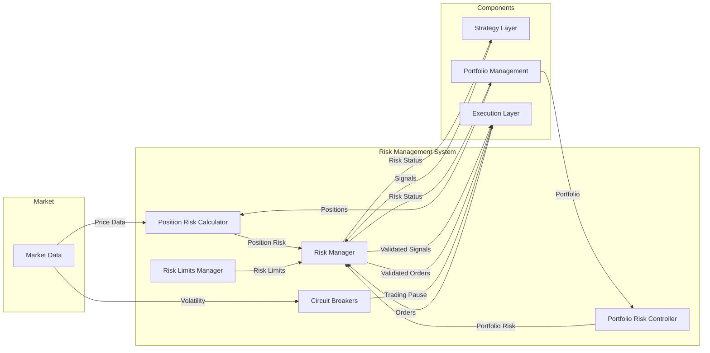
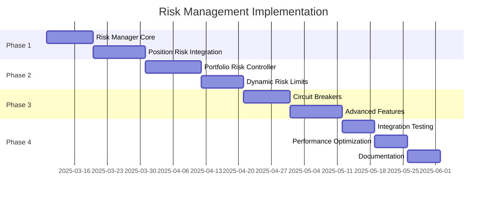
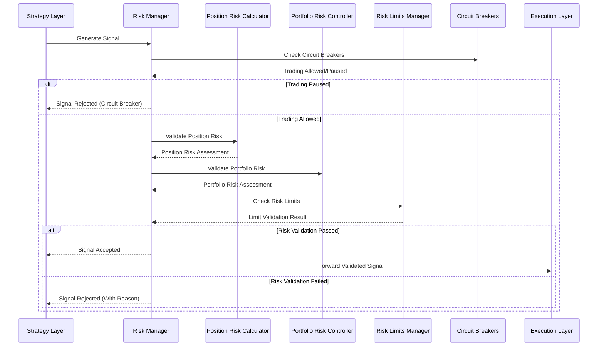

# Risk Management System Architecture

## Component Architecture

```mermaid
graph TD
    A[Risk Manager] --> B[Position Risk Calculator]
    A --> C[Portfolio Risk Controller]
    A --> D[Circuit Breakers]
    A --> E[Risk Limits Manager]
    
    B --> B1[Position Metrics]
    B --> B2[Stop Loss Manager]
    B --> B3[Take Profit Manager]
    B --> B4[Trailing Stop Logic]
    
    C --> C1[Portfolio Metrics]
    C --> C2[Correlation Analysis]
    C --> C3[VaR Calculator]
    C --> C4[Position Sizing]
    
    D --> D1[Volatility Detector]
    D --> D2[Drawdown Monitor]
    D --> D3[Trading Pauser]
    D --> D4[Manual Override]
    
    E --> E1[Limit Registry]
    E --> E2[Dynamic Adjuster]
    E --> E3[Utilization Tracker]
    E --> E4[Validation Engine]
    
    %% Event flows
    S[Strategy Layer] -.-> |SignalEvent| A
    A -.-> |ValidationEvent| X[Execution Layer]
    X -.-> |OrderEvent| A
    A -.-> |CircuitBreakerEvent| X
    P[Portfolio Layer] <-.-> |PositionEvent| B
    P <-.-> |PortfolioEvent| C
    
    %% Existing components
    Z1[Existing Position Risk Analyzer] -.-> B
    Z2[Existing Dynamic Risk Limits] -.-> E
    
    %% Style
    classDef primary fill:#f9f,stroke:#333,stroke-width:2px;
    classDef secondary fill:#bbf,stroke:#333,stroke-width:1px;
    classDef external fill:#ddd,stroke:#333,stroke-width:1px;
    classDef existing fill:#bfb,stroke:#333,stroke-width:1px;
    
    class A,B,C,D,E primary;
    class B1,B2,B3,B4,C1,C2,C3,C4,D1,D2,D3,D4,E1,E2,E3,E4 secondary;
    class S,X,P external;
    class Z1,Z2 existing;
```



## Data Flow Diagram



## Implementation Timeline



## Risk Validation Process



## Circuit Breaker Logic

```mermaid
stateDiagram-v2
    [*] --> Normal
    
    Normal --> VolatilityWarning: Volatility > 1.5x Normal
    Normal --> DrawdownWarning: Drawdown > 5%
    
    VolatilityWarning --> Normal: Volatility Normalizes
    DrawdownWarning --> Normal: Recovery
    
    VolatilityWarning --> TradingPaused: Volatility > 2.5x Normal
    DrawdownWarning --> TradingPaused: Drawdown > 10%
    
    Normal --> TradingPaused: Manual Pause
    Normal --> TradingPaused: Technical Circuit Breaker
    
    TradingPaused --> LimitedTrading: Partial Recovery
    TradingPaused --> Normal: Full Recovery or Timer Expires
    
    LimitedTrading --> Normal: Conditions Normalize
    LimitedTrading --> TradingPaused: Conditions Worsen