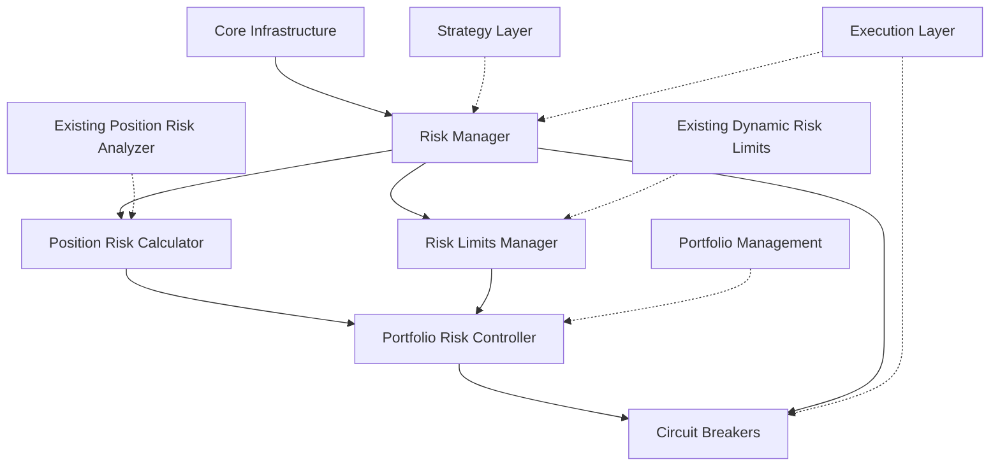

# Risk Management System Development Plan

*AI Crypto Trading Agent - Strategic Implementation Plan*  
*Version: 1.0*  
*Last Updated: March 2, 2025*

## 1. Executive Summary

This document outlines the strategic development plan for enhancing the Risk Management System within the AI Crypto Trading Agent. Based on the technical specifications detailed in `risk_management_technical_spec.md`, this plan provides a structured approach to development, including timeline, resource requirements, dependencies, and success criteria.

The Risk Management System will be developed in four phases over a 12-week period, with clearly defined milestones and deliverables to ensure steady progress and maintain alignment with project goals. This plan builds upon the existing risk management components (`position_risk_analyzer.py` and `dynamic_risk_limits.py`) while introducing new capabilities.

## 2. Implementation Approach

### 2.1 Development Philosophy

The implementation will follow these guiding principles:

- **Component-Based Development**: Each component will be developed and tested independently before integration
- **Iterative Implementation**: Start with core functionality and iteratively add advanced features
- **Test-Driven Development**: Comprehensive testing at every stage to ensure robustness
- **Continuous Integration**: Regular integration with the main codebase to avoid integration issues
- **Documentation-First**: Update documentation with each feature implementation

### 2.2 Development Workflow


### 2.3 Prioritization Criteria

Features will be prioritized based on:

1. **Risk Protection Value**: Impact on protecting trading capital
2. **Implementation Complexity**: Effort required vs. benefit gained
3. **Dependencies**: Prerequisites for other system components
4. **Strategic Alignment**: Alignment with overall system goals

## 3. Current Risk Management Capabilities

Before outlining new development, it's important to understand the existing functionality:

### 3.1 Position Risk Analyzer

The existing `position_risk_analyzer.py` provides:
- Value at Risk (VaR) calculations using historical, parametric, and Monte Carlo methods
- Expected shortfall calculations
- Maximum drawdown analysis
- Volatility estimation
- Correlation analysis for portfolio assets
- Stress testing for portfolios
- Visualization tools for risk metrics

### 3.2 Dynamic Risk Limits

The existing `dynamic_risk_limits.py` provides:
- Dynamic adjustment of risk parameters based on performance
- Risk limit enforcement
- Dynamic position sizing

### 3.3 Integration Points

The current risk components interface with:
- Position management to assess position-level risk
- Portfolio management for overall exposure
- Backtesting for historical risk analysis

## 4. Development Timeline

### 4.1 Phase Overview


### 4.2 Detailed Timeline

#### Phase 1: Core Risk Manager and Position Risk (Weeks 1-3)

| Week | Tasks | Deliverables |
|------|-------|--------------|
| 1 | - Setup Risk Manager component structure<br>- Implement basic risk event definitions<br>- Create risk validation interfaces<br>- Integrate with existing Position Risk Analyzer | - Risk Manager skeleton<br>- Event definitions<br>- Initial unit tests |
| 2 | - Enhance Position Risk Calculator with trailing stops<br>- Implement automatic stop-loss and take-profit adjustment<br>- Create risk validation pipeline | - Enhanced Position Risk Calculator<br>- Risk metrics calculation<br>- Test suite for position risk |
| 3 | - Implement Risk Limits Manager<br>- Create core limit types<br>- Integrate with Strategy and Execution layers | - Risk Limits Manager<br>- Basic integration with other components<br>- Documentation update |

*Milestone 1: Core risk validation functionality working with existing components*

#### Phase 2: Portfolio Risk and Dynamic Risk Limits (Weeks 4-6)

| Week | Tasks | Deliverables |
|------|-------|--------------|
| 4 | - Implement Portfolio Risk Controller structure<br>- Develop enhanced portfolio metrics calculations<br>- Create exposure tracking | - Portfolio Risk Controller<br>- Portfolio metrics dashboard<br>- Unit tests for portfolio metrics |
| 5 | - Enhance position sizing algorithms<br>- Develop correlation analysis<br>- Improve Value at Risk calculations | - Enhanced position sizing module<br>- Correlation matrix generation<br>- VaR and Expected Shortfall metrics |
| 6 | - Enhance dynamic risk limit adjustments<br>- Develop risk limit utilization tracking<br>- Integrate with Portfolio Management | - Dynamic limit adjustment<br>- Portfolio integration<br>- Documentation update |

*Milestone 2: Portfolio-wide risk management functioning*

#### Phase 3: Circuit Breakers and Advanced Features (Weeks 7-9)

| Week | Tasks | Deliverables |
|------|-------|--------------|
| 7 | - Implement Circuit Breaker component<br>- Develop market volatility detection<br>- Create trading pause mechanism | - Circuit Breaker component<br>- Volatility detection algorithms<br>- Trading pause functionality |
| 8 | - Implement drawdown and performance breakers<br>- Develop manual override capabilities<br>- Create breaker notification system | - Additional breaker types<br>- Manual override UI<br>- Notification integration |
| 9 | - Implement advanced risk features<br>- Develop stress testing scenarios<br>- Create risk simulation tools | - Advanced risk features<br>- Stress testing framework<br>- Documentation update |

*Milestone 3: Complete risk protection system functioning*

#### Phase 4: Testing, Optimization, and Documentation (Weeks 10-12)

| Week | Tasks | Deliverables |
|------|-------|--------------|
| 10 | - Conduct comprehensive integration testing<br>- Perform scenario-based testing<br>- Identify and fix integration issues | - Integration test suite<br>- Scenario test results<br>- Bug fixes |
| 11 | - Optimize performance<br>- Conduct load testing<br>- Fine-tune risk parameters | - Performance optimization<br>- Load test results<br>- Optimized parameters |
| 12 | - Complete documentation<br>- Develop user guides<br>- Prepare training materials | - Complete documentation<br>- User guides<br>- Training materials |

*Milestone 4: Production-ready Risk Management System*

## 5. Resource Requirements

### 5.1 Development Team

| Role | Responsibilities | Required Skills | Allocation |
|------|------------------|-----------------|------------|
| Backend Developer | Implement core risk components | Python, asyncio, event-driven architecture | 2 full-time |
| Quantitative Developer | Develop risk models and algorithms | Statistics, financial mathematics, Python | 1 full-time |
| QA Engineer | Create and execute test plans | Testing methodologies, Python, automation | 1 part-time |
| DevOps Engineer | CI/CD setup, deployment, monitoring | CI/CD tools, monitoring, AWS/cloud | 1 part-time |
| Technical Writer | Documentation, user guides | Technical writing, markdown, diagrams | 1 part-time |

### 5.2 Technical Resources

- Development and testing environments
- Continuous integration and deployment pipeline
- Code repository and version control
- Testing frameworks and tools
- Performance monitoring tools
- Historical market data for backtesting and simulation

### 5.3 External Dependencies

- Access to exchange APIs for real-time data
- Historical data provider for backtesting risk models
- Mathematical libraries for statistical calculations

## 6. Dependencies and Critical Path

### 6.1 Internal Dependencies



### 6.2 Critical Path Analysis

The critical path for implementation is:

1. Core Risk Manager setup
2. Integration with existing Position Risk Analyzer
3. Risk Limits Manager development
4. Portfolio Risk Controller implementation
5. Circuit Breakers development
6. System integration and testing

Delays in any of these components will impact the overall project timeline.

### 6.3 External Dependencies

- Availability of historical data for developing and testing risk models
- Exchange API stability for real-time data feeds
- Integration with existing codebase components

## 7. Risk Factors and Mitigation

| Risk | Impact | Probability | Mitigation Strategy |
|------|--------|------------|---------------------|
| Complex risk algorithms require more development time | High | Medium | Begin with simpler implementations and iteratively enhance; use established libraries where possible |
| Integration issues with existing components | High | Medium | Develop clear interfaces; conduct regular integration testing; maintain communication with component owners |
| Performance bottlenecks in risk calculations | Medium | Medium | Implement caching strategies; optimize critical algorithms; consider Rust implementation for performance-critical calculations |
| Inadequate test market data for unusual scenarios | Medium | High | Source diverse historical data; create synthetic data for edge cases; implement scenario generation |
| Changing requirements during development | Medium | High | Maintain flexible architecture; use iterative development approach; regular stakeholder reviews |

## 8. Success Criteria and KPIs

### 8.1 Implementation Success Criteria

- All components successfully implemented and integrated
- Unit test coverage of at least 90% for all risk components
- All integration tests passing
- Performance benchmarks met (risk validation < 50ms)
- Documentation complete and up-to-date
- No critical or high-severity bugs

### 8.2 Operational KPIs

- **Drawdown Reduction**: Reduction in maximum drawdown by at least 30% compared to unmanaged strategies
- **Risk-Adjusted Returns**: Improved Sharpe ratio by at least 15%
- **System Response Time**: Risk validations complete in under 50ms for 99% of requests
- **Breach Prevention**: Successfully prevent at least 95% of potential risk limit breaches
- **Circuit Breaker Accuracy**: False positive rate < 5% for circuit breaker activations
- **Strategy Stability**: Reduction in strategy volatility by at least 20%
- **Position Sizing Optimization**: Asset allocation efficiency improved by at least 15%
- **Risk Forecast Accuracy**: Value at Risk prediction accuracy > 95% at specified confidence levels

## 9. Implementation Challenges and Solutions

### 9.1 Algorithmic Challenges

| Challenge | Solution |
|-----------|----------|
| Accurate Value at Risk in volatile crypto markets | Implement adaptive VaR models that adjust to changing market regimes; use multiple calculation methods (historical, parametric, Monte Carlo) and select the most conservative estimate |
| Real-time risk calculation performance | Implement incremental calculation methods; leverage caching for intermediate results; consider Rust implementation for calculation-intensive components |
| Correlation instability during market stress | Implement dynamic correlation models that adjust during stress periods; use stress-adjusted correlations for extreme scenarios |

### 9.2 Integration Challenges

| Challenge | Solution |
|-----------|----------|
| Consistent event handling across components | Define clear event schemas; implement robust event validation; provide comprehensive event documentation |
| Latency in distributed risk validation | Implement local risk checks with periodic synchronization; use tiered validation approach with fast local checks and more comprehensive central validation |
| Balancing risk management with trading opportunities | Create configurable risk thresholds by strategy type; implement graduated risk responses rather than binary approve/reject |

### 9.3 User Experience Challenges

| Challenge | Solution |
|-----------|----------|
| Making risk metrics understandable | Develop intuitive risk dashboards with clear visualizations; provide context for risk metrics with historical comparisons and industry benchmarks |
| Managing risk alert fatigue | Implement intelligent alert aggregation; provide risk summaries with actionable insights; allow customizable alert thresholds |
| Explaining circuit breaker activations | Create detailed event logging for all breaker activations; provide clear explanations for activations; include market context in notifications |

## 10. Integration with Existing Risk Components

### 10.1 Position Risk Analyzer Integration

The existing `position_risk_analyzer.py` provides solid foundations for risk metrics calculations. The integration approach will be:

1. **Wrapper Development**: Create a component wrapper that adapts the existing analyzer to the event-driven architecture
2. **API Enhancement**: Extend the analyzer API to support asynchronous operations
3. **Event Publication**: Add event publication for key risk metric updates
4. **Performance Optimization**: Optimize performance-critical calculations
5. **Feature Extension**: Add new risk metrics while maintaining backward compatibility

### 10.2 Dynamic Risk Limits Integration

The existing `dynamic_risk_limits.py` will be integrated with the new Risk Limits Manager:

1. **Core Logic Preservation**: Maintain the core logic for dynamic limit adjustment
2. **Interface Standardization**: Standardize interfaces for consistent interaction
3. **Configuration Enhancement**: Implement more flexible configuration options
4. **Event Integration**: Add event-based triggers for limit adjustments
5. **Monitoring Improvements**: Enhance monitoring and reporting of limit adjustments

## 11. Conclusion and Next Steps

The Risk Management System enhancement represents a critical component for ensuring the long-term sustainability and stability of the AI Crypto Trading Agent. By implementing a comprehensive risk framework, the system will protect capital while enabling efficient trading strategies.

### 11.1 Immediate Next Steps

1. Conduct a detailed review of existing risk components
2. Finalize the component interfaces and event definitions
3. Create development environments and testing infrastructure
4. Begin implementation of the Risk Manager component

### 11.2 Long-Term Vision

The Risk Management System lays the foundation for more advanced risk capabilities:

- Machine learning-based risk prediction
- Market regime-specific risk parameters
- Multi-asset portfolio optimization
- Regulatory compliance frameworks
- Institutional-grade risk reporting

By investing in robust risk management now, the system will be well-positioned for future growth and expanded trading capabilities.

## Appendix A: Risk Component Details

| Component | Primary Responsibility | Key Interfaces | Event Types |
|-----------|------------------------|----------------|-------------|
| Risk Manager | Central coordination | Strategy, Execution | SignalValidation, OrderValidation, RiskStatus |
| Position Risk Calculator | Position-level metrics | Portfolio Management | PositionRisk, StopLossUpdate |
| Portfolio Risk Controller | Overall exposure management | Portfolio Management | PortfolioRisk, ExposureUpdate |
| Risk Limits Manager | Risk limit enforcement | All components | LimitBreached, LimitUpdated |
| Circuit Breakers | Trading pause control | Execution | BreakerActivated, BreakerDeactivated |

## Appendix B: Key Risk Algorithms

1. **Adaptive Value at Risk (VaR)**
   ```python
   def calculate_adaptive_var(returns, confidence_level, lookback_window=None):
       """
       Calculate VaR with adaptive lookback window based on market volatility.
       """
       # Determine optimal lookback based on recent volatility
       if lookback_window is None:
           recent_vol = np.std(returns[-30:])
           long_term_vol = np.std(returns)
           vol_ratio = recent_vol / long_term_vol
           
           # Adjust lookback window based on volatility ratio
           if vol_ratio > 1.5:  # Higher recent volatility
               lookback_window = min(60, len(returns))  # Shorter lookback
           elif vol_ratio < 0.75:  # Lower recent volatility
               lookback_window = min(250, len(returns))  # Longer lookback
           else:
               lookback_window = min(120, len(returns))  # Standard lookback
       
       # Use lookback window to calculate VaR
       recent_returns = returns[-lookback_window:]
       var = np.percentile(recent_returns, (1 - confidence_level) * 100)
       
       return var
   ```

2. **Dynamic Position Sizing**
   ```python
   def calculate_position_size(account_equity, asset_volatility, risk_per_trade_pct=0.01, 
                              max_position_pct=0.25, stop_loss_std_multiplier=2.0):
       """
       Calculate position size based on volatility and account risk parameters.
       """
       # Maximum position size based on account percentage limit
       max_position_size = account_equity * max_position_pct
       
       # Risk-based position size
       risk_amount = account_equity * risk_per_trade_pct
       stop_loss_pct = asset_volatility * stop_loss_std_multiplier
       position_size = risk_amount / stop_loss_pct
       
       # Use the smaller of the two constraints
       return min(position_size, max_position_size)
   ```

3. **Circuit Breaker Activation Logic**
   ```python
   def evaluate_circuit_breaker(market_data, strategy_performance, thresholds):
       """
       Evaluate whether circuit breakers should be activated.
       """
       activation_reasons = []
       
       # Check for excessive market volatility
       recent_vol = market_data["recent_volatility"]
       normal_vol = market_data["normal_volatility"]
       if recent_vol > normal_vol * thresholds["volatility_multiplier"]:
           activation_reasons.append({
               "type": "market_volatility",
               "severity": "high",
               "metric": recent_vol / normal_vol,
               "threshold": thresholds["volatility_multiplier"]
           })
       
       # Check for extreme drawdown
       if strategy_performance["current_drawdown"] > thresholds["max_drawdown"]:
           activation_reasons.append({
               "type": "strategy_drawdown",
               "severity": "high",
               "metric": strategy_performance["current_drawdown"],
               "threshold": thresholds["max_drawdown"]
           })
       
       # Determine if breaker should be activated
       should_activate = len(activation_reasons) > 0
       
       return {
           "should_activate": should_activate,
           "reasons": activation_reasons,
           "suggested_duration": calculate_pause_duration(activation_reasons)
       }