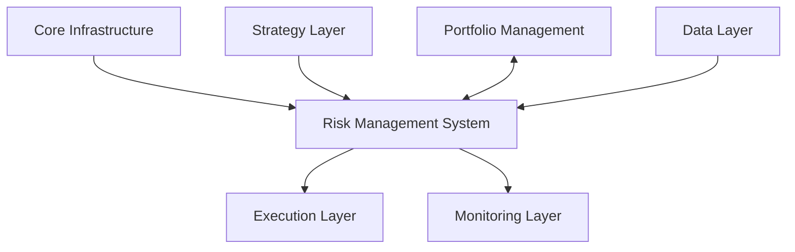
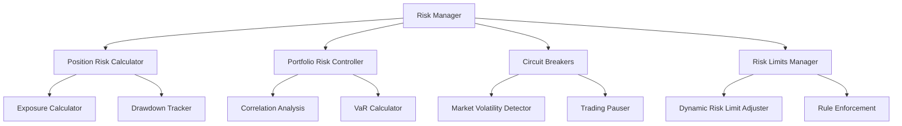

# Risk Management System Technical Specification

*AI Crypto Trading Agent - Technical Specification*  
*Version: 1.0*  
*Last Updated: March 2, 2025*

## 1. Executive Summary

This document outlines the technical specifications for implementing comprehensive risk management capabilities within the AI Crypto Trading Agent system. The risk management system will protect trading capital, prevent catastrophic losses, and ensure the long-term sustainability of trading strategies across various market conditions.

The implementation follows a component-based design consistent with the existing architecture, communicating through the central event bus and maintaining a clear separation of concerns.

## 2. System Overview

### 2.1 Purpose

The Risk Management System will:

- Monitor and control risk at position, strategy, and portfolio levels
- Implement dynamic risk limits based on market conditions and performance
- Provide circuit breakers to pause trading during adverse conditions
- Enable sophisticated position sizing and exposure management
- Track and enforce various risk metrics (drawdown, VaR, etc.)

### 2.2 Integration with Existing Architecture



The Risk Management System serves as a critical control layer between strategy generation and order execution, with bidirectional communication with the Portfolio Management layer.

## 3. Component Architecture

The Risk Management System consists of five primary components:



## 4. Detailed Component Specifications

### 4.1 Risk Manager

**Purpose**: Central coordination of all risk management activities

**Responsibilities**:
- Initialize and coordinate all risk subsystems
- Validate trading signals against risk parameters
- Relay risk-related events and status updates
- Maintain risk state and facilitate risk-based decisions

**Interfaces**:
```python
class RiskManager(Component):
    async def initialize() -> None
    async def start() -> None
    async def stop() -> None
    
    # Risk validation interfaces
    async def validate_signal(signal: Signal) -> Tuple[bool, str]
    async def validate_order(order: Order) -> Tuple[bool, str]
    
    # Risk state interfaces
    async def get_risk_status() -> Dict[str, Any]
    async def get_risk_metrics() -> Dict[str, float]
    
    # Risk control interfaces
    async def update_risk_limits(limits: Dict[str, float]) -> None
    async def pause_trading(reason: str, duration: Optional[int] = None) -> None
    async def resume_trading() -> None
```

**Event Subscriptions**:
- `SignalEvent`: To validate signals against risk parameters
- `OrderEvent`: To validate orders before execution
- `MarketDataEvent`: To update risk models with current prices
- `SystemStatusEvent`: To react to system state changes

**Event Publications**:
- `RiskStatusEvent`: Updates on risk system status
- `RiskMetricEvent`: Updates on key risk metrics
- `TradingPausedEvent`: Notification when trading is paused
- `TradingResumedEvent`: Notification when trading is resumed

**Configuration Options**:
```yaml
risk_manager:
  enabled: true
  max_validation_delay_ms: 200
  logging_level: "INFO"
  metrics_update_interval_sec: 60
```

### 4.2 Position Risk Calculator

**Purpose**: Manage risk for individual trading positions

**Responsibilities**:
- Calculate risk metrics for individual positions
- Manage stop-loss and take-profit levels
- Implement trailing stop logic
- Track position-specific exposure
- Monitor unrealized P&L and risk-reward ratios

**Key Classes and Methods**:
```python
class PositionRiskCalculator(Component):
    async def calculate_position_risk(position: Position) -> PositionRisk
    async def update_stop_loss(position_id: str, stop_loss: float) -> None
    async def update_take_profit(position_id: str, take_profit: float) -> None
    async def enable_trailing_stop(position_id: str, trail_pct: float) -> None
    async def update_position_with_price(position_id: str, price: float) -> None
    async def get_position_exit_recommendation(position_id: str) -> Optional[ExitRecommendation]
```

**Key Algorithms**:
- **Trailing Stop**: 
  ```
  if position_direction == "long":
      if current_price > highest_price:
          highest_price = current_price
          new_stop_loss = highest_price * (1 - trailing_pct)
          if new_stop_loss > current_stop_loss:
              current_stop_loss = new_stop_loss
  else:  # short position
      if current_price < lowest_price:
          lowest_price = current_price
          new_stop_loss = lowest_price * (1 + trailing_pct)
          if new_stop_loss < current_stop_loss:
              current_stop_loss = new_stop_loss
  ```

- **Risk-Reward Ratio**: 
  ```
  if entry_price and stop_loss and take_profit:
      potential_loss = abs(entry_price - stop_loss)
      potential_gain = abs(take_profit - entry_price)
      risk_reward_ratio = potential_gain / potential_loss if potential_loss > 0 else float('inf')
  ```

**Configuration Options**:
```yaml
position_risk_calculator:
  enabled: true
  default_stop_loss_pct: 0.02
  default_take_profit_pct: 0.06
  enable_trailing_stops: true
  default_trailing_pct: 0.015
  min_risk_reward_ratio: 2.0
  position_risk_update_interval_sec: 30
```

### 4.3 Portfolio Risk Controller

**Purpose**: Manage risk across the entire portfolio of positions

**Responsibilities**:
- Calculate and control overall portfolio exposure
- Implement position sizing based on volatility and risk metrics
- Ensure proper diversification across assets
- Calculate portfolio-level metrics (VaR, expected shortfall, etc.)
- Prevent overexposure to correlated assets

**Key Classes and Methods**:
```python
class PortfolioRiskController(Component):
    async def calculate_portfolio_metrics() -> PortfolioRiskMetrics
    async def get_max_position_size(symbol: str, direction: str) -> float
    async def validate_new_position(symbol: str, size: float, direction: str) -> Tuple[bool, str]
    async def calculate_correlation_matrix() -> Dict[Tuple[str, str], float]
    async def calculate_value_at_risk(confidence: float = 0.95) -> float
    async def get_portfolio_exposure() -> Dict[str, float]
    async def get_asset_allocation() -> Dict[str, float]
```

**Key Algorithms**:
- **Position Sizing Based on Volatility**:
  ```
  target_risk_per_trade = account_equity * max_risk_per_trade_pct
  asset_volatility = calculate_volatility(symbol, lookback_period)
  position_size = target_risk_per_trade / (asset_volatility * stop_loss_multiplier)
  ```

- **Value at Risk (Parametric Method)**:
  ```
  portfolio_value = sum(position.value for position in positions)
  portfolio_volatility = calculate_portfolio_volatility(positions, correlation_matrix)
  z_score = norm.ppf(confidence_level)  # Using standard normal distribution
  var = portfolio_value * portfolio_volatility * z_score
  ```

**Configuration Options**:
```yaml
portfolio_risk_controller:
  enabled: true
  max_portfolio_risk_pct: 0.05
  max_risk_per_trade_pct: 0.01
  max_exposure_per_asset_pct: 0.25
  max_correlation_exposure: 0.50
  volatility_lookback_days: 30
  confidence_level: 0.95
  portfolio_update_interval_sec: 60
```

### 4.4 Circuit Breakers

**Purpose**: Temporarily pause trading during adverse conditions

**Responsibilities**:
- Detect unusual market volatility
- Monitor drawdown and performance metrics
- Implement trading pauses when conditions warrant
- Provide manual override capabilities
- Manage resumption of trading when conditions normalize

**Key Classes and Methods**:
```python
class CircuitBreaker(Component):
    async def check_market_conditions(symbol: str) -> CircuitBreakerResult
    async def activate_breaker(reason: str, duration_sec: Optional[int]) -> None
    async def deactivate_breaker(breaker_id: str) -> None
    async def get_active_breakers() -> List[ActiveCircuitBreaker]
    async def is_trading_allowed(symbol: str) -> Tuple[bool, str]
    async def override_breaker(breaker_id: str, reason: str) -> None
```

**Rules Engine Example**:
```python
class CircuitBreakerRules:
    def evaluate_breaker_conditions(data: Dict[str, Any]) -> List[CircuitBreakerResult]:
        results = []
        
        # Check for rapid price movement
        if "price_change_pct" in data and abs(data["price_change_pct"]) > VOLATILITY_THRESHOLD:
            results.append(CircuitBreakerResult(
                triggered=True,
                reason=f"Excessive volatility: {data['price_change_pct']:.2f}%",
                suggested_duration_sec=1800  # 30 minutes
            ))
        
        # Check for unusual volume
        if "volume_z_score" in data and abs(data["volume_z_score"]) > VOLUME_THRESHOLD:
            results.append(CircuitBreakerResult(
                triggered=True,
                reason=f"Abnormal volume: z-score={data['volume_z_score']:.2f}",
                suggested_duration_sec=3600  # 1 hour
            ))
        
        # Check for strategy drawdown
        if "strategy_drawdown" in data and data["strategy_drawdown"] > MAX_STRATEGY_DRAWDOWN:
            results.append(CircuitBreakerResult(
                triggered=True,
                reason=f"Strategy drawdown limit reached: {data['strategy_drawdown']:.2f}%",
                suggested_duration_sec=86400  # 24 hours
            ))
        
        return results
```

**Configuration Options**:
```yaml
circuit_breakers:
  enabled: true
  check_interval_sec: 60
  volatility_breakers:
    enabled: true
    short_window_sec: 300
    long_window_sec: 3600
    threshold_pct: 5.0
    pause_duration_sec: 1800
  drawdown_breakers:
    enabled: true
    max_strategy_drawdown_pct: 10.0
    max_account_drawdown_pct: 15.0
    pause_duration_sec: 86400
  volume_breakers:
    enabled: true
    volume_z_score_threshold: 3.0
    pause_duration_sec: 3600
  manual_override_allowed: true
```

### 4.5 Risk Limits Manager

**Purpose**: Define, track, and enforce risk limits throughout the system

**Responsibilities**:
- Maintain a registry of risk limits and their current values
- Track utilization of risk limits
- Dynamically adjust limits based on performance
- Validate operations against applicable limits
- Trigger notifications when limits are approached or breached

**Key Classes and Methods**:
```python
class RiskLimitsManager(Component):
    async def register_limit(limit: RiskLimit) -> str
    async def update_limit(limit_id: str, new_value: float) -> None
    async def get_limit(limit_id: str) -> RiskLimit
    async def get_limits_by_scope(scope: str, scope_id: Optional[str] = None) -> List[RiskLimit]
    async def check_limit(limit_id: str, value: float) -> LimitCheckResult
    async def track_limit_usage(limit_id: str, usage: float) -> None
    async def get_limit_utilization(limit_id: str) -> float
```

**Dynamic Limit Adjustment Algorithm**:
```python
async def adjust_limits_based_on_performance(performance_metrics: Dict[str, float]) -> None:
    # Increase limits on good performance
    if performance_metrics["sharpe_ratio"] > 1.5 and performance_metrics["drawdown_pct"] < 5.0:
        for limit in await get_limits_by_scope("strategy"):
            new_value = limit.value * 1.1  # 10% increase
            max_value = limit.max_allowed_value
            if new_value <= max_value:
                await update_limit(limit.id, new_value)
    
    # Decrease limits on poor performance
    elif performance_metrics["sharpe_ratio"] < 0.5 or performance_metrics["drawdown_pct"] > 10.0:
        for limit in await get_limits_by_scope("strategy"):
            new_value = limit.value * 0.9  # 10% decrease
            min_value = limit.min_allowed_value
            if new_value >= min_value:
                await update_limit(limit.id, new_value)
```

**Configuration Options**:
```yaml
risk_limits_manager:
  enabled: true
  default_limits:
    max_position_size_usd: 10000.0
    max_positions_per_strategy: 5
    max_positions_per_asset: 3
    max_daily_drawdown_pct: 5.0
    max_trade_frequency_per_hour: 10
  dynamic_adjustment:
    enabled: true
    adjustment_interval_hours: 24
    max_increase_pct: 50.0
    max_decrease_pct: 70.0
  limit_notifications:
    warning_threshold_pct: 80.0
    critical_threshold_pct: 95.0
```

## 5. Data Models

### 5.1 Risk Limit

```python
class RiskLimitType(str, Enum):
    MAX_POSITION_SIZE = "max_position_size"
    MAX_POSITIONS_COUNT = "max_positions_count"
    MAX_DRAWDOWN = "max_drawdown"
    MAX_DAILY_LOSS = "max_daily_loss"
    MAX_EXPOSURE = "max_exposure"
    MAX_LEVERAGE = "max_leverage"
    MAX_TRADE_FREQUENCY = "max_trade_frequency"
    # Additional limit types as needed

class RiskLimitScope(str, Enum):
    SYSTEM = "system"
    STRATEGY = "strategy"
    ASSET = "asset"
    EXCHANGE = "exchange"

class RiskLimit(BaseModel):
    id: str = Field(default_factory=lambda: str(uuid.uuid4()))
    name: str
    description: str = ""
    limit_type: RiskLimitType
    value: float
    min_allowed_value: Optional[float] = None
    max_allowed_value: Optional[float] = None
    scope: RiskLimitScope
    scope_id: Optional[str] = None  # E.g., specific strategy ID or asset
    is_active: bool = True
    is_dynamic: bool = False  # Can be adjusted automatically
    created_at: datetime = Field(default_factory=datetime.utcnow)
    updated_at: datetime = Field(default_factory=datetime.utcnow)
```

### 5.2 Position Risk

```python
class ExitRecommendation(str, Enum):
    HOLD = "hold"
    TAKE_PROFIT = "take_profit"
    STOP_LOSS = "stop_loss"
    TRAILING_STOP = "trailing_stop"
    TIME_BASED = "time_based"
    RISK_LIMIT = "risk_limit"

class PositionRisk(BaseModel):
    position_id: str
    symbol: str
    strategy_id: str
    entry_price: float
    current_price: float
    size: float
    direction: str  # "long" or "short"
    unrealized_pnl: float
    unrealized_pnl_pct: float
    stop_loss: Optional[float] = None
    take_profit: Optional[float] = None
    trailing_stop_enabled: bool = False
    trailing_stop_activation_price: Optional[float] = None
    trailing_stop_distance_pct: Optional[float] = None
    max_favorable_excursion: float  # Highest profit reached
    max_adverse_excursion: float  # Deepest drawdown reached
    risk_reward_ratio: Optional[float] = None
    days_held: float
    exit_recommendation: ExitRecommendation = ExitRecommendation.HOLD
    exit_reason: Optional[str] = None
    position_started: datetime
    last_updated: datetime
```

### 5.3 Portfolio Risk Metrics

```python
class PortfolioRiskMetrics(BaseModel):
    timestamp: datetime = Field(default_factory=datetime.utcnow)
    total_equity: float
    total_positions_value: float
    total_positions_count: int
    long_exposure: float
    short_exposure: float
    net_exposure: float
    net_exposure_pct: float
    gross_exposure: float
    gross_exposure_pct: float
    highest_concentration_symbol: str
    highest_concentration_pct: float
    value_at_risk_95: float
    value_at_risk_99: float
    expected_shortfall: float
    sharpe_ratio: Optional[float] = None
    sortino_ratio: Optional[float] = None
    current_drawdown_pct: float
    max_drawdown_pct: float
    positions_by_symbol: Dict[str, int]
    exposure_by_symbol: Dict[str, float]
    exposure_by_strategy: Dict[str, float]
```

### 5.4 Circuit Breaker

```python
class CircuitBreakerType(str, Enum):
    VOLATILITY = "volatility"
    DRAWDOWN = "drawdown"
    VOLUME = "volume"
    PERFORMANCE = "performance"
    MANUAL = "manual"
    TECHNICAL = "technical"

class CircuitBreakerResult(BaseModel):
    triggered: bool
    reason: Optional[str] = None
    suggested_duration_sec: Optional[int] = None
    severity: str = "warning"

class ActiveCircuitBreaker(BaseModel):
    id: str = Field(default_factory=lambda: str(uuid.uuid4()))
    breaker_type: CircuitBreakerType
    reason: str
    activated_at: datetime = Field(default_factory=datetime.utcnow)
    duration_sec: Optional[int] = None
    expires_at: Optional[datetime] = None
    scope: str = "global"
    scope_id: Optional[str] = None  # E.g., specific symbol
    triggered_by: str  # Component that triggered the breaker
    override_allowed: bool = True
```

## 6. Event Definitions

### 6.1 Risk Status Events

```python
class RiskStatusEvent(Event):
    event_type: str = "RiskStatusEvent"
    source: str
    status: str  # "normal", "warning", "critical"
    message: str
    metrics: Dict[str, Any] = Field(default_factory=dict)
    timestamp: datetime = Field(default_factory=datetime.utcnow)

class RiskLimitEvent(Event):
    event_type: str = "RiskLimitEvent"
    source: str
    limit_id: str
    limit_name: str
    limit_type: str
    limit_value: float
    current_value: float
    utilization_pct: float
    status: str  # "normal", "warning", "breach"
    message: str
    timestamp: datetime = Field(default_factory=datetime.utcnow)

class CircuitBreakerEvent(Event):
    event_type: str = "CircuitBreakerEvent"
    source: str
    breaker_id: str
    breaker_type: str
    action: str  # "activated", "deactivated", "override"
    reason: str
    scope: str = "global"
    scope_id: Optional[str] = None
    duration_sec: Optional[int] = None
    expires_at: Optional[datetime] = None
    timestamp: datetime = Field(default_factory=datetime.utcnow)

class PositionRiskEvent(Event):
    event_type: str = "PositionRiskEvent"
    source: str
    position_id: str
    symbol: str
    risk_metrics: Dict[str, Any]
    exit_recommendation: Optional[str] = None
    exit_reason: Optional[str] = None
    timestamp: datetime = Field(default_factory=datetime.utcnow)

class PortfolioRiskEvent(Event):
    event_type: str = "PortfolioRiskEvent"
    source: str
    portfolio_metrics: Dict[str, Any]
    risk_status: str  # "normal", "warning", "critical"
    timestamp: datetime = Field(default_factory=datetime.utcnow)
```

## 7. Integration with Existing Components

### 7.1 Strategy Layer Integration

The Risk Management System will interact with the Strategy Layer through:

1. **Signal Validation**: The Risk Manager will validate trading signals against risk parameters before they are passed to the Execution Layer.

2. **Strategy-Specific Limits**: Each strategy will have its own set of risk limits in the Risk Limits Manager.

3. **Strategy Performance Feedback**: The Portfolio Risk Controller will track performance metrics for strategies to adjust risk parameters dynamically.

```python
# Example signal validation flow
async def handle_signal_event(event: SignalEvent) -> None:
    signal = event.signal
    
    # Validate against risk limits
    is_valid, reason = await risk_manager.validate_signal(signal)
    
    if is_valid:
        # Signal passed risk validation, forward to execution
        await event_bus.publish(ValidationPassedEvent(signal=signal))
    else:
        # Signal rejected by risk management
        await event_bus.publish(ValidationRejectedEvent(
            signal=signal,
            reason=reason,
            source="risk_manager"
        ))
        logger.warning(f"Signal rejected by risk management: {reason}")
```

### 7.2 Execution Layer Integration

The Risk Management System will interact with the Execution Layer through:

1. **Order Validation**: The Risk Manager will validate orders against risk parameters before they are submitted to exchanges.

2. **Circuit Breaker Control**: Circuit Breakers can halt the submission of new orders during adverse conditions.

3. **Position Size Calculation**: The Portfolio Risk Controller will determine appropriate position sizes for orders.

```python
# Example order validation flow
async def handle_order_event(event: OrderEvent) -> None:
    order = event.order
    
    # Check if trading is currently allowed
    trading_allowed, reason = await circuit_breaker.is_trading_allowed(order.symbol)
    if not trading_allowed:
        await event_bus.publish(OrderRejectedEvent(
            order=order,
            reason=f"Trading paused: {reason}",
            source="circuit_breaker"
        ))
        return
    
    # Validate order against risk limits
    is_valid, reason = await risk_manager.validate_order(order)
    
    if is_valid:
        # Order passed risk validation, submit to exchange
        await event_bus.publish(OrderValidatedEvent(order=order))
    else:
        # Order rejected by risk management
        await event_bus.publish(OrderRejectedEvent(
            order=order,
            reason=reason,
            source="risk_manager"
        ))
```

### 7.3 Portfolio Management Integration

The Risk Management System will have bidirectional integration with Portfolio Management:

1. **Position Updates**: Portfolio Management will provide position updates to the Position Risk Calculator.

2. **Risk-Adjusted Position Management**: Risk parameters will influence how positions are managed.

3. **Portfolio Metrics Sharing**: Both systems will share metrics about the portfolio state.

```python
# Example position update flow
async def handle_position_update_event(event: PositionUpdateEvent) -> None:
    position = event.position
    
    # Update position risk metrics
    position_risk = await position_risk_calculator.calculate_position_risk(position)
    
    # Check for exit recommendations
    exit_recommendation = await position_risk_calculator.get_position_exit_recommendation(position.id)
    
    if exit_recommendation and exit_recommendation.recommendation != ExitRecommendation.HOLD:
        # Recommend exiting the position
        await event_bus.publish(PositionExitRecommendationEvent(
            position_id=position.id,
            symbol=position.symbol,
            recommendation=exit_recommendation.recommendation,
            reason=exit_recommendation.reason,
            source="position_risk_calculator"
        ))
```

## 8. Implementation Roadmap

### 8.1 Phase 1: Core Risk Manager and Position Risk (Weeks 1-3)

- Set up basic Risk Manager component
- Implement Position Risk Calculator with stop-loss and take-profit functionality
- Create fundamental risk limit types
- Define and register core risk events
- Integration with Strategy and Execution layers for basic validation

### 8.2 Phase 2: Portfolio Risk and Dynamic Risk Limits (Weeks 4-6)

- Implement Portfolio Risk Controller
- Add correlation analysis and position sizing algorithms
- Develop Value at Risk calculations
- Create dynamic risk limit adjustment logic
- Integrate with Portfolio Management layer

### 8.3 Phase 3: Circuit Breakers and Advanced Features (Weeks 7-9)

- Implement Circuit Breaker system
- Add volatility and drawdown detection
- Develop trading pause mechanisms
- Create manual override capabilities
- Add stress testing and risk simulation features

### 8.4 Phase 4: Testing, Optimization, and Documentation (Weeks 10-12)

- Comprehensive testing under various market conditions
- Performance optimization
- Integration testing with all system components
- Complete documentation and developer guides
- User interface for risk management control

## 9. Testing Strategy

### 9.1 Unit Testing

- Test all risk calculations with known inputs and expected outputs
- Test limit enforcement logic
- Test circuit breaker conditions and activation
- Test position risk metrics and recommendations

### 9.2 Integration Testing

- Test interaction with Strategy layer for signal validation
- Test interaction with Execution layer for order validation
- Test interaction with Portfolio Management for position monitoring
- Test event publishing and subscription across components

### 9.3 Scenario Testing

- Simulate rapid market movements to test circuit breakers
- Test gradually increasing positions to verify limit enforcement
- Test recovery from drawdown scenarios
- Test handling of correlated asset movements

### 9.4 Stress Testing

- Test system under extreme market volatility
- Test with high-frequency trading signals
- Test with multiple strategies operating simultaneously
- Test system recovery after simulated crashes or pauses

## 10. Key Performance Indicators

The following KPIs will be tracked to measure the effectiveness of the Risk Management System:

1. Drawdown reduction compared to unmanaged strategies
2. Percentage of loss-making trades stopped by risk rules
3. Improvement in Sharpe ratio with risk management enabled
4. Accuracy of Value at Risk predictions
5. System response time for risk validations (target < 50ms)
6. Correct circuit breaker activations vs. false positives
7. Risk limit utilization efficiency

## 11. Conclusion

The Risk Management System will provide comprehensive protection against excessive trading risks while allowing strategies to operate efficiently within safe parameters. The system is designed to be adaptable to changing market conditions and will improve trading outcomes through sophisticated risk modeling and proactive risk mitigation.

This technical specification provides a detailed blueprint for implementing all aspects of the Risk Management System, from individual position protection to portfolio-wide risk controls and emergency circuit breakers.