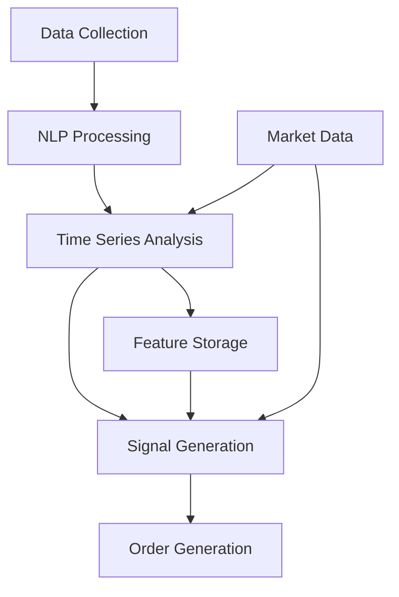

# Sentiment Analysis System

## Overview

The Sentiment Analysis System is a core component of the AI Trading Agent that generates trading signals based on sentiment data from various sources. It combines natural language processing (NLP) with time series analysis to extract actionable insights from textual data and convert them into effective trading strategies.

## System Architecture

The sentiment analysis system consists of several interconnected components:

1. **Data Collection**: Gathers sentiment data from multiple sources (social media, news, market indicators)
2. **NLP Processing**: Analyzes text to extract sentiment scores, entities, and topics
3. **Time Series Analysis**: Transforms sentiment scores into time series features
4. **Signal Generation**: Converts sentiment features into trading signals
5. **Order Generation**: Translates signals into executable orders with position sizing



## Time Series Features

The system generates a comprehensive set of time series features from sentiment data to capture different aspects of market sentiment dynamics:

### 1. Lag Features

Lag features capture historical sentiment values, allowing the model to identify patterns and trends over time.

```python
# Example usage
lag_features = create_lag_features(sentiment_series, lags=[1, 5, 10, 21])
```

These features are critical for:
- Identifying sentiment momentum
- Detecting trend reversals
- Measuring sentiment persistence

### 2. Difference Features

Difference features calculate changes in sentiment over various periods, highlighting acceleration or deceleration in market sentiment.

```python
# Example usage
diff_features = create_diff_features(sentiment_series, periods=[1, 5, 10])
```

Applications include:
- Detecting sentiment shifts
- Measuring sentiment volatility
- Identifying regime changes

### 3. Percentage Change Features

Percentage change features normalize changes relative to the base value, making them comparable across different assets and time periods.

```python
# Example usage
pct_change_features = create_pct_change_features(sentiment_series, periods=[1, 5, 10])
```

These are useful for:
- Cross-asset comparison
- Identifying significant relative changes
- Normalizing sentiment movements

### 4. Rolling Window Features

Rolling window features calculate statistics over sliding windows of time, providing smoothed metrics and volatility measures.

```python
# Example usage
rolling_mean = create_rolling_window_features(sentiment_series, windows=[5, 10, 21], function='mean')
rolling_std = create_rolling_window_features(sentiment_series, windows=[5, 10, 21], function='std')
```

Supported functions include:
- `mean`: Average sentiment over the window
- `std`: Sentiment volatility
- `min`/`max`: Extreme sentiment values
- `sum`: Cumulative sentiment

### 5. Advanced Features

The `SentimentTimeSeriesAnalyzer` class provides additional advanced features:

#### Sentiment Trend

Identifies directional trends in sentiment data:

```python
trend = analyzer.detect_sentiment_trends(
    sentiment_data,
    sentiment_column='compound',
    window_size=10,
    threshold=0.1
)
```

Returns values:
- `1`: Uptrend
- `-1`: Downtrend
- `0`: No clear trend

#### Sentiment Anomalies

Detects unusual sentiment values that deviate significantly from recent patterns:

```python
anomalies = analyzer.detect_sentiment_anomalies(
    sentiment_data,
    sentiment_column='compound',
    window_size=21,
    std_threshold=2.0
)
```

Returns:
- `1`: Positive anomaly
- `-1`: Negative anomaly
- `0`: Normal sentiment

#### Sentiment Momentum

Calculates the difference between short-term and long-term sentiment moving averages:

```python
momentum = analyzer.calculate_sentiment_momentum(
    sentiment_data,
    sentiment_column='compound',
    short_window=5,
    long_window=21
)
```

Positive values indicate accelerating positive sentiment, while negative values indicate accelerating negative sentiment.

#### Sentiment Volatility

Measures the variability of sentiment over time:

```python
volatility = analyzer.calculate_sentiment_volatility(
    sentiment_data,
    sentiment_column='compound',
    window_size=21
)
```

Higher values indicate more erratic sentiment, which might suggest market uncertainty.

#### Rate of Change and Acceleration

Measures the speed of sentiment changes and the change in that speed:

```python
roc = analyzer.calculate_sentiment_rate_of_change(
    sentiment_data,
    sentiment_column='compound',
    period=5
)

acceleration = analyzer.calculate_sentiment_acceleration(
    sentiment_data,
    sentiment_column='compound',
    period=5
)
```

## Signal Generation

The `SentimentStrategy` class converts sentiment features into trading signals through a sophisticated process:

### 1. Weighted Sentiment Score

First, a weighted sentiment score is calculated by combining various features:

```python
def _calculate_weighted_sentiment_score(self, data):
    # Initialize weighted score column
    data['weighted_sentiment_score'] = 0.0
    
    # Base features to include in weighted score
    base_features = ['compound']
    
    # Add available time series features
    time_series_features = [
        'sentiment_trend', 'sentiment_momentum', 'sentiment_anomaly',
        'sentiment_volatility', 'sentiment_roc', 'sentiment_acceleration'
    ]
    
    # Check which features are available
    available_features = base_features + [f for f in time_series_features if f in data.columns]
    
    # Calculate weighted score based on available features
    for feature in available_features:
        if feature in data.columns:
            weight = self.feature_weights.get(feature, 0.0)
            feature_values = data[feature].fillna(0)
            data['weighted_sentiment_score'] += weight * feature_values
    
    # Add lag features with decreasing weights for older lags
    lag_features = [col for col in data.columns if 'compound_lag_' in col]
    if lag_features:
        # Sort and apply decreasing weights
        lag_features.sort(key=lambda x: int(x.split('_')[-1]))
        for i, feature in enumerate(lag_features):
            lag_weight = self.feature_weights.get('compound', 1.0) * (0.9 ** (i + 1))
            feature_values = data[feature].fillna(0)
            data['weighted_sentiment_score'] += lag_weight * feature_values
```

### 2. Signal Generation

The weighted score is then converted into trading signals with confirmation from multiple features:

```python
def _generate_signal_from_sentiment(self, data):
    # Basic threshold-based signals
    data.loc[data['weighted_sentiment_score'] > self.sentiment_threshold, 'signal'] = 1
    data.loc[data['weighted_sentiment_score'] < -self.sentiment_threshold, 'signal'] = -1
    
    # Enhance signals with trend confirmation if available
    if 'sentiment_trend' in data.columns:
        # Strengthen signals when trend confirms sentiment
        trend_confirms_long = (data['weighted_sentiment_score'] > 0) & (data['sentiment_trend'] > 0)
        trend_confirms_short = (data['weighted_sentiment_score'] < 0) & (data['sentiment_trend'] < 0)
        
        data.loc[trend_confirms_long & (data['signal'] == 1), 'signal'] = 1.2
        data.loc[trend_confirms_short & (data['signal'] == -1), 'signal'] = -1.2
        
        # Weaken signal when trend contradicts
        trend_contradicts_long = (data['weighted_sentiment_score'] > 0) & (data['sentiment_trend'] < 0)
        trend_contradicts_short = (data['weighted_sentiment_score'] < 0) & (data['sentiment_trend'] > 0)
        
        data.loc[trend_contradicts_long & (data['signal'] == 1), 'signal'] = 0.5
        data.loc[trend_contradicts_short & (data['signal'] == -1), 'signal'] = -0.5
```

### 3. Position Sizing

Position sizes are calculated based on signal strength and risk parameters:

```python
def _calculate_position_sizes(self, data):
    # Risk-based position sizing
    if 'volatility' in data.columns and 'price' in data.columns:
        for idx, row in data.iterrows():
            if row['signal'] != 0:
                # Calculate position size based on risk
                risk_amount = self.portfolio_value * self.risk_per_trade
                risk_per_share = row['price'] * self.stop_loss_pct
                position_size = risk_amount / risk_per_share
                # Cap at max position size
                position_size = min(position_size, self.max_position_size)
                data.loc[idx, 'position_size'] = position_size * data.loc[idx, 'signal']
```

### 4. Stop Loss and Take Profit

The strategy also calculates appropriate stop loss and take profit levels:

```python
def _calculate_stop_loss_take_profit(self, data):
    # For long positions
    long_mask = data['signal'] == 1
    data.loc[long_mask, 'stop_loss'] = data.loc[long_mask, 'price'] * (1 - self.stop_loss_pct)
    data.loc[long_mask, 'take_profit'] = data.loc[long_mask, 'price'] * (1 + self.take_profit_pct)
    
    # Adjust based on volatility if available
    if 'sentiment_volatility' in data.columns:
        volatility_scale = data['sentiment_volatility'] / data['sentiment_volatility'].median()
        volatility_scale = volatility_scale.clip(1.0, 2.0)  # Limit scaling factor
        
        # Wider stops for higher volatility
        data.loc[long_mask, 'stop_loss'] = data.loc[long_mask, 'price'] * (1 - self.stop_loss_pct * volatility_scale.loc[long_mask])
```

## Configuration

The sentiment analysis system is highly configurable through the configuration system:

```yaml
sentiment_analysis:
  data_collection:
    sources:
      - twitter
      - reddit
      - news_api
    cache_expiry_hours: 24
    
  nlp_processing:
    model: "vader"  # Options: vader, transformers, finbert
    
  time_series:
    default_lags: [1, 2, 3, 5, 10, 21]
    default_windows: [5, 10, 21, 63]
    
  strategy:
    sentiment_threshold: 0.2
    sentiment_window: 5
    position_sizing_method: "risk_based"  # Options: fixed, risk_based, sentiment_scaled
    stop_loss_pct: 0.05
    take_profit_pct: 0.1
    max_position_size: 1.0
    risk_per_trade: 0.02
    
    feature_weights:
      compound: 1.0
      sentiment_trend: 0.8
      sentiment_momentum: 0.7
      sentiment_anomaly: 0.5
      sentiment_volatility: -0.3
      sentiment_roc: 0.6
      sentiment_acceleration: 0.4
```

## Performance Optimization

The sentiment analysis system leverages the Rust integration for performance-critical operations:

1. **Feature Engineering**: Time series transformations are accelerated using Rust implementations
2. **Fallback Mechanism**: Python implementations are available when Rust extensions aren't available
3. **Caching**: Sentiment data is cached to avoid redundant processing

## Usage Examples

### Basic Usage

```python
from src.sentiment_analysis.service import SentimentAnalysisService

# Initialize the service
config = {
    "data_collection": {"sources": ["twitter", "news_api"]},
    "strategy": {"sentiment_threshold": 0.25}
}
service = SentimentAnalysisService(config)

# Collect sentiment data
sentiment_data = service.collect_sentiment_data(
    symbols=["BTC", "ETH"],
    start_date="2023-01-01",
    end_date="2023-01-31"
)

# Generate features
features = service.generate_features(sentiment_data)

# Generate trading signals
signals = service.generate_trading_signals(
    market_data=market_data,
    symbols=["BTC", "ETH"]
)

# Generate orders
orders = service.generate_orders(
    signals=signals,
    timestamp=current_time,
    current_positions=portfolio.positions
)
```

### Advanced Configuration

```python
# Custom feature weights
config = {
    "strategy": {
        "feature_weights": {
            "compound": 1.0,
            "sentiment_trend": 1.2,  # Increased weight for trend
            "sentiment_momentum": 0.9,
            "sentiment_volatility": -0.5  # Stronger negative weight for volatility
        }
    }
}
service = SentimentAnalysisService(config)
```

## Future Enhancements

Planned improvements to the sentiment analysis system include:

1. **Deep Learning Models**: Integration with transformer-based models for more nuanced sentiment analysis
2. **Entity-Level Sentiment**: Analyzing sentiment for specific entities (companies, products, people)
3. **Topic Modeling**: Identifying key topics and their sentiment in financial news
4. **Cross-Asset Sentiment**: Analyzing how sentiment in one asset affects others
5. **Real-Time Processing**: Stream processing for live sentiment analysis

## Troubleshooting

### Common Issues

1. **Missing Features**: If expected features are missing, check if the required columns exist in the input data
2. **Weak Signals**: If signals seem too weak, adjust the `sentiment_threshold` and feature weights
3. **Performance Issues**: Ensure Rust extensions are properly compiled and available
4. **Data Quality**: Poor-quality sentiment data can lead to noisy signals; consider filtering or preprocessing

## References

- VADER Sentiment Analysis: Hutto, C.J. & Gilbert, E.E. (2014)
- FinBERT: Araci, D. (2019)
- Time Series Feature Engineering: Christ, M., et al. (2018)
